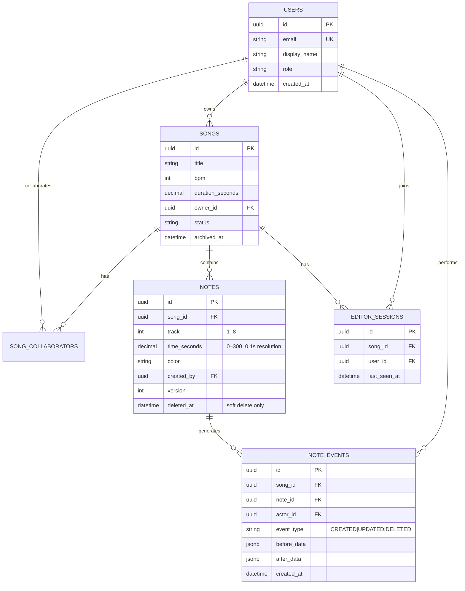
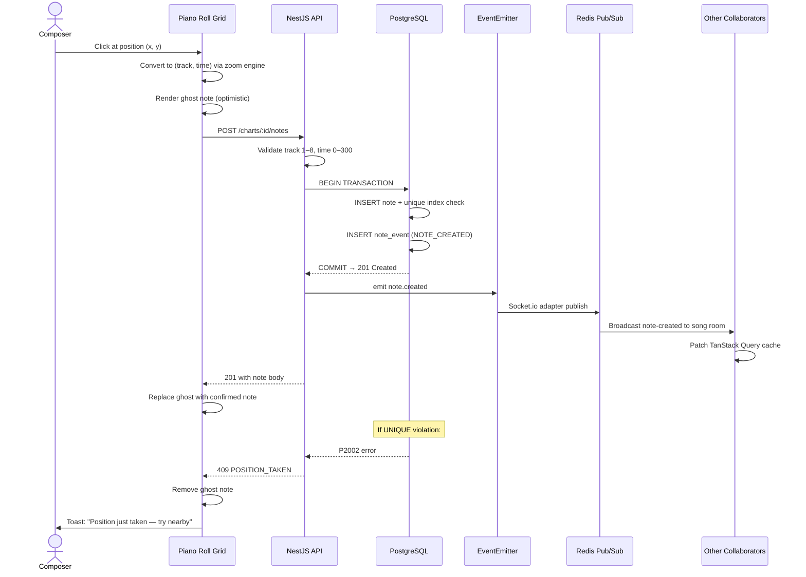
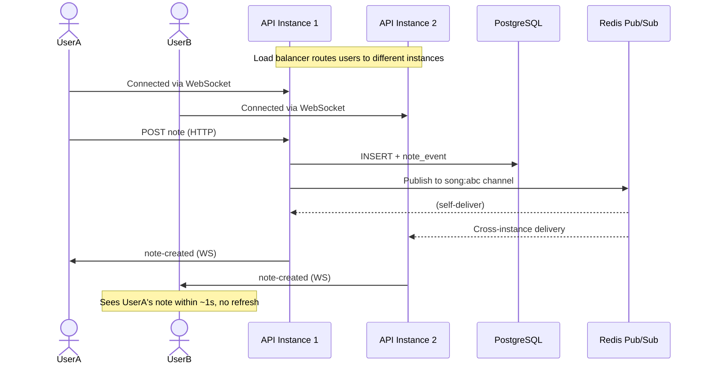
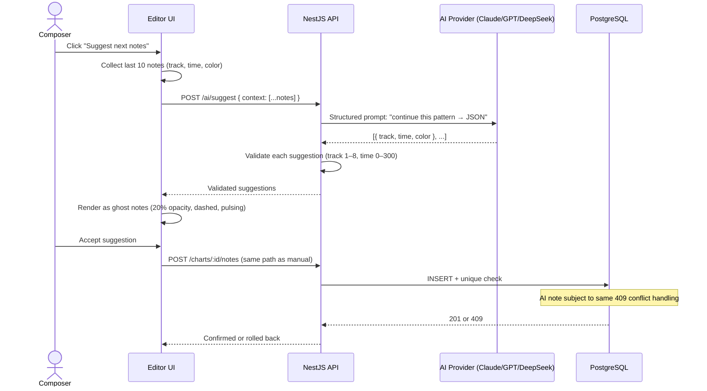

# AMA-MIDI

> **A real-time collaborative MIDI sequencer built for Amanotes-style cross-functional teams.**
>
> Composers, game developers, and QA engineers editing the same song on an 8-track × 300-second piano roll — with atomic duplicate prevention at the database layer, an event-sourced change ledger, and DOM virtualization that stays responsive at 10,000 notes.

**Live demo:** [ama-midi.hvy-dev.uk](https://ama-midi.hvy-dev.uk) · **API health:** [/api/health](https://ama-midi.hvy-dev.uk/api/health)

> **Grader quick-nav:**
> [Use Case Coverage](docs/project/00-usecase-coverage.md) — required vs delivered, all 8 use cases, all 9 grading categories.
> [k6 Test Report](docs/project/12-k6-test-report.md) — 100 VU results, root cause, fix (3.03s → 37ms p95).
> [Feature Implementations](docs/project/features/) — 7 deep-dive files (Realtime.md format) with sequence diagrams, trade-offs, and scaling proposals per feature.

---

## The Problem I Started With

Amanotes builds music-based games. The creative pipeline looks like this: a composer places notes, a game developer checks timing alignment, a product owner reviews structure, and QA catches anything out of range. This cycle repeats with every revision.

The status quo for most teams: **export a file → email → import → discover a conflict → email again.**

When I read the case study brief, I resisted building immediately. I asked: *what is the actual problem here?* The answer changed everything.

Composers already have MIDI editors. The missing piece is a **shared context layer** — one surface where all four roles can see the same data, in real time, without corrupting each other's work. AMA-MIDI is that layer, not a better MIDI editor.

This framing drove three hard requirements:


| Property                 | Why it's non-negotiable                                                                                                    |
| ------------------------ | -------------------------------------------------------------------------------------------------------------------------- |
| **Data integrity**       | Two notes at the same (track, time) is a corruption, not a conflict to merge. Must be enforced atomically at the DB layer. |
| **Real-time sync**       | A game developer reads the note data as authoritative. No eventual consistency — changes must propagate within ~1 second.  |
| **Performance at scale** | 10,000 notes on a song is realistic for a polished game soundtrack. The editor must stay usable.                           |


---

## Actors & Use Cases

Before writing a line of code, I mapped four distinct actors. The insight: **they all need the same data through a different lens.** One product, four presentations.

```
┌──────────────────────────────────────────────────────────────────────────────┐
│                               AMA-MIDI System                                │
│                                                                              │
│  ┌──────────────┐    ┌──────────────┐    ┌──────────────┐    ┌─────────────┐ │
│  │  Composer /  │    │  Game Dev    │    │  Product     │    │  QA /       │ │
│  │  Sound       │    │              │    │  Owner       │    │  Tester     │ │
│  │  Designer    │    │              │    │              │    │             │ │
│  └──────┬───────┘    └──────┬───────┘    └──────┬───────┘    └──────┬──────┘ │
│         │                   │                   │                   │        │
│  • Place notes fast   • Inspect coords    • Browse songs      • Audit        │
│  • Stay in flow       • Verify alignment  • Read-only review  • Flag issues  │
│  • Accept AI ghosts   • View ledger       • Visual summary    • View history │
│  • Undo last action   • Dev View mode     • Song card density • QA View mode │
│                                                                              │
│                     Shared: same note data, same DB                          │
└──────────────────────────────────────────────────────────────────────────────┘
```

## Feature Hierarchy

Features are organized by delivery phase. Each tier answers the question: *who is blocked without this?*

Full detail: `[docs/project/03-features.md](docs/project/03-features.md)`

```
Cross-Cutting — Conflict Resolution
│
├─ Instant rejection (real-time create → 409 → ghost rollback + toast)
├─ Batch resolve (ConflictReviewModal — shared by pattern paste, copy/move/repeat,
│   undo restore, tap apply, AI chart merge)
│   Preview → Apply → resolve conflicts (Keep all existing / Apply all incoming)
└─ Live negotiation (deferred — toast-only for concurrent slot races today)

P0 — Core Editor (Composer, solo)
│
├─ Google OAuth + JWT auth
├─ Song CRUD
├─ Piano roll grid (8 tracks × 0–300s vertical timeline)
├─ Note CRUD (TAP / HOLD / SWIPE)
├─ Fast Mode (default — click → instant note, no dialog)
├─ Popup Mode (title, description, color, track, time, duration)
├─ DB-level duplicate prevention (UNIQUE partial index — atomic, not app-only)
├─ Optimistic UI (ghost note on click, rollback on 409)
├─ Conflict toast ("This position was just taken — try a nearby spot")
├─ Role-based access control (Admin / Composer / Viewer)
├─ Editor engine (coordinate math, viewport windows, zoom-safe)
└─ 5-zone app shell (toolbar, left panel, timeline, right panel, footer)

P1 — Collaboration & Integrity (All four actors together)
│
├─ Real-time note sync (Socket.io + Redis Pub/Sub)
├─ User presence (session avatars in editor)
├─ Change history / event ledger (immutable note_events)
├─ Undo via compensating event (+ conflict modal when slots changed)
├─ Snap-to-grid (0.1s, beat, half-beat)
├─ Viewport zoom (1× / 2× / 4× / 8×)
├─ 10,000-note rendering (Y-axis DOM virtualization, ~80 active nodes)
├─ Chunked API fetch (visible time window + prefetch)
├─ Rate limiting (30 creates/min per user)
├─ CSRF + security hardening (Helmet, throttling, validation pipe)
├─ Role-based view modes (Composer / Developer / QA)
├─ VIEWER read-only editor (mutations hidden)
├─ Validation rule engine (boundary, gap, density, empty-track)
├─ Song version snapshots (named save + restore)
└─ Concurrent conflict test (Promise.all race, not sequential)

Phase 2 — Identity & Onboarding
│
├─ Profile setup (title, department — presence becomes meaningful)
├─ Google avatar sync
├─ Live cursor presence on grid (Figma-style labeled dots, throttled)
├─ Routed first-login onboarding (Welcome → Features → Notes → Profile)
├─ Take a Tour (cross-route product walkthrough, re-launchable)
└─ Login page redesign (product-first entry)

Phase 3 — Rhythm Game Editor
│
├─ BPM + time signature, beat grid rendering (bar / beat lines)
├─ Note types: TAP / HOLD (drag duration) / SWIPE
├─ Multi-select (Shift+click, bulk bar actions)
├─ Pattern library (save selection, paste at playhead)
├─ Pattern paste → preview → apply → conflict resolve
├─ Tap to rhythm (loop range, home-row keys A S D F · J K L ;, TAP + HOLD)
│   Draft overlay → apply to chart or save as pattern → conflict resolve
├─ Section markers + jump list (Intro / Verse / Chorus…)
├─ Game Preview mode (visual playhead — no scoring)
├─ Difficulty heatmap overlay (NPS bands on grid)
└─ Combo + difficulty stats in footer

Phase 4 — Production Workspace
│
├─ Projects as production workspaces
├─ Project membership + per-song scope
├─ Song status workflow (Draft → In Review → Approved → Published / Needs Fix)
├─ Dashboard (recent, assigned, "Needs My Review")
├─ Project directory + workspace tabs (Songs / Members / Settings)
├─ Create Song wizard (blank / template / import)
└─ Multi-chart songs (difficulty/speed variants per SongChart)

Phase 5 — Composition Productivity
│
├─ Editor commands + multi-level undo (one user action = one undo unit)
├─ Copy to / Move to / Repeat / Stamp (preview → conflict resolve)
├─ HOLD default-create UX (drag-down duration in fast mode)
├─ Backing track playback (reference audio, playhead-synced)
├─ Chart note synth (playhead-crossing sounds, mute per track)
└─ Editor focus polish (track identity, calmer grid, panel hierarchy)

Phase 6 — AI & Difficulty Analysis
│
├─ AI Assistant modal (SSE progress tree)
│   ├─ Generate chart (description → preview bar → apply / replace w/ confirm)
│   ├─ Scale difficulty (tier target → full replacement preview)
│   ├─ Fill track (lane + instruction → chart preview → merge + conflicts)
│   └─ Improve pattern — Extend / Refine (selection deep-link → chart preview)
├─ AI chart preview layer (TAP circles + HOLD bars, conflict highlighting)
├─ Global chart context for AI (sections, density segments, chart totals)
├─ Difficulty analysis engine (shared analyzeChart(), tier + segments)
├─ Analysis Board (dedicated page, publish gate on ERROR)
└─ Live editor validation panel (debounced client + server persistence)

Phase 7 — Collaboration Polish
│
├─ Session presence center (toolbar menu with title / department)
├─ Collaborator activity batching (readable notices vs event flood)
├─ Realtime cursor overlay fix (scroll/zoom accurate)
└─ Live create conflict negotiation (deferred — beyond toast-only)

Deferred (P2)
├─ Timeline comments pinned to (time, track)
├─ Export to game engine JSON format
├─ MIDI file import/export
├─ Mobile editing
└─ Waveform rendering

Explicitly out of scope
├─ Git-style branching (everyone is always on main)
├─ Scoring / gameplay simulation in editor (preview is visual + audio only)
├─ Keyboard playtesting as a game (tap-to-rhythm is authoring, not scoring)
├─ LLM-driven repeat/stamp (deterministic interval math)
├─ Multi-tenancy / cross-project song sharing
└─ Section locking (DB conflict model instead)
```

---

## System Architecture

### Stack

```
┌────────────────────────────────────────────────────────────────────┐
│  apps/web (React 18 + Vite + TypeScript)          Vercel           │
│  ├─ TanStack Query — server state, cached by time window           │
│  ├─ Zustand        — editor mode, zoom, selection (client state)   │
│  ├─ @tanstack/virtual — Y-axis note virtualization (~80 DOM nodes) │
│  └─ Socket.io-client — WS connection, merges events → TQ cache     │
└────────────────────────────────────────────────────────────────────┘
                             │  HTTPS + WSS
┌────────────────────────────────────────────────────────────────────┐
│  apps/api (NestJS + TypeScript)                   Railway           │
│  ├─ AuthModule      — Google OAuth, Passport.js, JWT guards        │
│  ├─ SongModule      — Song CRUD, ownership                         │
│  ├─ NoteModule      — Note CRUD; P2002 → 409, never 500            │
│  ├─ LedgerModule    — Immutable NoteEvent rows (before/after JSONB)│
│  ├─ RealtimeModule  — Socket.io gateway + Redis adapter            │
│  └─ AiModule        — Anthropic / OpenAI / DeepSeek, note suggests │
└────────────────────────────────────────────────────────────────────┘
         │  Prisma (ACID)              │  Pub/Sub + cursors
┌──────────────────┐         ┌──────────────────────┐
│  PostgreSQL 15   │         │  Redis 7             │
│  notes           │         │  WebSocket fan-out   │
│  note_events     │         │  Ephemeral cursors   │
│  editor_sessions │         │  (5s TTL)            │
└──────────────────┘         └──────────────────────┘
```

**Why modular monolith, not microservices?** Microservices pay off when multiple teams need independent release cycles and services see different load profiles. For a single engineer with a 3-day build window, they add distributed tracing, inter-service network calls, and shared-type sync with zero benefit. The NestJS module system gives clean boundaries — each module owns its domain, communicates through defined interfaces. If scale requires it, these are natural microservice cut points. That's a deliberate choice, not deferred cleanup.

### Entity Relationship




**Critical index (the heart of integrity):**

```sql
CREATE UNIQUE INDEX uq_notes_song_track_time_active
ON notes (song_id, track, time_seconds)
WHERE deleted_at IS NULL;
```

This partial unique index enforces position uniqueness atomically at the database engine level. Application-level pre-checks cannot handle the race: two concurrent requests both query "is this position taken?" — both see `false` before either commits — both succeed. The DB constraint allows exactly one winner regardless of timing.

---

## Key Capabilities


| Capability                  | How It Works                                                                                                                   |
| --------------------------- | ------------------------------------------------------------------------------------------------------------------------------ |
| **Piano Roll Editor**       | 8-track × 300s vertical timeline. Notes as colored circles at precise (track, time) positions.                                 |
| **Fast Mode**               | Click grid → note placed instantly (optimistic UI). No form interruption.                                                      |
| **Duplicate Prevention**    | `UNIQUE (song_id, track, time) WHERE deleted_at IS NULL` — atomic, race-safe. DB layer, not app layer.                         |
| **Real-time Collaboration** | Socket.io rooms per song. Redis Pub/Sub fans events to all API instances. Changes visible in < 1s.                             |
| **Change Ledger**           | Every mutation writes an immutable `NoteEvent` with `before_state` / `after_state` JSONB. Undo = compensating event.           |
| **10,000-note Performance** | Two-layer windowing: API returns the visible time window; client clamps to viewport. ~80 active DOM nodes regardless of total. |
| **AI Note Suggester**       | Last 10 notes → Claude / OpenAI / DeepSeek → 3–5 pattern-continuation suggestions → ghost overlays (accept/dismiss per note).  |
| **Role-based Access**       | Admin / Composer / Developer / Viewer enforced at NestJS route guards and React UI layer simultaneously.                       |


---

## Feature Workflows

### Note Creation (Happy Path + Conflict Path)




### Real-Time Collaboration (Multi-Instance)




### AI Note Suggestion




---

## Design Decisions & Trade-offs


| Decision                 | Chose                    | Rejected              | Gained                                  | Gave Up                             |
| ------------------------ | ------------------------ | --------------------- | --------------------------------------- | ----------------------------------- |
| **Deployment**           | Modular monolith         | Microservices         | Fast build, clean boundaries            | Independent service scaling         |
| **Conflict enforcement** | DB unique constraint     | App-level pre-check   | Atomic race safety                      | Richer pre-validation messages      |
| **History model**        | Event sourcing (ledger)  | Git-style branching   | Simple undo, full audit trail           | Experimental branch versions        |
| **Note rendering**       | DOM virtualization       | Canvas                | Browser events, accessibility           | Higher raw rendering ceiling        |
| **UI feedback**          | Optimistic UI            | Server-wait           | Instant feel, flow state                | More complex rollback logic         |
| **Time resolution**      | 0.1s snap                | Millisecond precision | Perceptually clean constraints          | Ultra-fine timing (not needed here) |
| **State split**          | TanStack Query + Zustand | Redux                 | Best-fit tool per concern               | Single-store mental model           |
| **Auth**                 | Google OAuth SSO         | Username/password     | IT-controlled access                    | Google Workspace dependency         |
| **Zoom state**           | Global Zustand atom      | Component-local state | Fetch window & rendering always in sync | Slightly more lifted state          |


**The three I thought hardest about:**

**DB constraint vs app check** — Application-level checks have a concurrency window: two requests both read "position empty" before either commits. The DB constraint closes that window entirely. No amount of optimistic locking or transaction isolation level in the service layer fixes the fundamental race.

**Event sourcing vs Git branching** — Git is designed for asynchronous individual work. A live collaborative editor is the opposite — everyone is always on `main`, no branches, no merge. Event sourcing matches the actual semantics: each mutation is a fact that happened, recorded with before/after state. Undo is appending a compensating event, not mutating history.

**Optimistic UI vs server-wait** — At 30+ notes per minute in Fast Mode, a 200ms round-trip compounds into noticeable friction. The optimistic model trades rollback complexity for flow state preservation. Rollback is rare in practice (requires a concurrent conflict at the same position). The toast language ("position just taken") makes the rollback feel like a collaboration event, not an error.

---

## Testing Strategy

### API Unit Tests

```bash
cd apps/api && pnpm test
```

Tests read as behavioral contracts:

- Time < 0 is rejected (400)
- Time > 300 is rejected (400)
- Track < 1 is rejected (400)
- Track > 8 is rejected (400)
- Duplicate position → 409, not 500
- Every creation writes a `NOTE_CREATED` event
- Every deletion writes a `NOTE_DELETED` event with `before_data` populated
- Undo finds the last user action and emits a compensating event

**Concurrent conflict test (the important one):**

```typescript
// Promise.all tests the RACE, not sequential rejection
const [r1, r2] = await Promise.all([
  request(app).post(`/charts/${chartId}/notes`).send(payload),
  request(app).post(`/charts/${chartId}/notes`).send(payload),
])
expect([r1.status, r2.status].sort()).toEqual([201, 409])
// DB: exactly one row, never zero, never two
expect(count).toBe(1)
```

Sequential `await + await` would always produce 409 on the second call because the first has already committed. `Promise.all` tests the actual race condition.

### Load Test (k6)

100 virtual users, 30 seconds, `POST /charts/:id/notes`.


| Profile                | Requests | p95 latency | Status    |
| ---------------------- | -------- | ----------- | --------- |
| Smoke (1 VU, 2s pause) | 29       | 143ms       | ✅         |
| 100 VU (before fix)    | 1,443    | **3.03s**   | ❌ latency |


**Attempt 2: Latency Drop** (100 VU, after moving chart analysis off the hot path):


| Metric                   | Before    | After      |
| ------------------------ | --------- | ---------- |
| p95 latency (100 VU)     | 3.03s     | **37ms**   |
| Average latency (100 VU) | 2.05s     | 13ms       |
| Throughput               | ~45 req/s | ~880 req/s |
| 500 errors               | 0%        | 0%         |


Root cause: every note create was awaiting a full chart re-analysis (loading all 10,000 notes, running scoring, rewriting segments). Moved to debounced background job → 80× latency drop. Full narrative in [k6 Test Report](docs/project/12-k6-test-report.md).

---

## Project Documentation

Written in order — problem first, then decisions, then implementation. Each file is readable standalone.

> **For graders:** Start with [00 · Use Case Coverage](docs/project/00-usecase-coverage.md) — it maps every requirement from the brief against what was built, with status symbols (✅ delivered, 🔼 extended, 🔁 delivered differently, ⏳ phased, ❌ cut with rationale) and the full grading category coverage table.


| Doc                                                                                             | What It Covers                                                                               |
| ----------------------------------------------------------------------------------------------- | -------------------------------------------------------------------------------------------- |
| **[00 · Use Case Coverage](docs/project/00-usecase-coverage.md)**                               | **Required vs delivered — every use case, every actor, every grading category. Start here.** |
| [01 · Problem & Vision](docs/project/01-problem-and-vision.md)                                  | Why the workflow problem exists and what makes it technically hard.                          |
| [02 · Actors & Use Cases](docs/project/02-actors-and-use-cases.md)                              | The four roles and the UX decisions made for each.                                           |
| [03 · Feature Hierarchy](docs/project/03-features.md)                                           | P0/P1/Phase 2–7 priorities and what was cut and why.                                         |
| [04 · Design Thinking](docs/project/04-design-thinking.md)                                      | Six architecture decisions — opposing argument first, then the choice.                       |
| [05 · Architecture](docs/project/05-architecture.md)                                            | Stack, modules, data model, realtime topology.                                               |
| [06 · Workflows](docs/project/06-workflows.md)                                                  | Note create (happy + conflict), collaboration, AI suggester.                                 |
| [07 · Trade-offs](docs/project/07-trade-offs.md)                                                | What was gained and given up per decision.                                                   |
| [08 · Project Structure](docs/project/08-project-structure.md)                                  | Monorepo layout and boundary rationale.                                                      |
| [09 · Deploy Pipeline](docs/project/09-deploy.md)                                               | VPS deploy via Docker, Nginx, GitHub Actions.                                                |
| [10 · Performance & Correctness Testing](docs/project/10-performance-testing.md)                | Conflict, boundary, load, 10k UI, collaboration checks.                                      |
| [11 · Load Testing (k6)](docs/project/11-load-testing.md)                                       | How to reproduce the load test — seed, probe, smoke, full 100 VU.                            |
| [12 · k6 Test Report](docs/project/12-k6-test-report.md)                                        | First attempt (3.03s p95), root cause, fix, second attempt (37ms p95).                       |
| [13 · Retrospective](docs/project/13-retrospective.md)                                          | What I'd do differently and why the problem is genuinely hard.                               |
| [Realtime Architecture](docs/project/Realtime.md)                                               | Redis role, WebSocket room model, cursor TTL, internal event bus.                            |
| **Feature Implementations**                                                                     |                                                                                              |
| [Note CRUD & Duplicate Prevention](docs/project/features/F01-note-crud-duplicate-prevention.md) | DB constraint design, race condition proof, API error mapping.                               |
| [Change History & Ledger](docs/project/features/F02-change-history-ledger.md)                   | Event sourcing model, before/after JSONB, undo via compensating event.                       |
| [Optimistic UI](docs/project/features/F03-optimistic-ui.md)                                     | Ghost note pattern, rollback path, toast language design.                                    |
| [10,000-Note Performance](docs/project/features/F04-performance-10k-notes.md)                   | DOM virtualization, chunked API fetch, zoom as single source of truth.                       |
| [AI Note Suggester](docs/project/features/F05-ai-note-suggester.md)                             | Multi-provider pattern, ghost overlay UX, conflict handling on accept.                       |
| [Role-Based Access Control](docs/project/features/F06-role-based-access.md)                     | Guard layer, UI enforcement, permission matrix.                                              |
| [Tap to Rhythm](docs/project/features/F07-tap-to-rhythm.md)                                     | Loop recording, home-row keymap, draft apply, save as pattern, conflict preview.             |


---

## Quick Start

```bash
# Clone and install
git clone git@github.com:3xhvy/ama-midi.git
cd ama-midi
pnpm install

# Configure environment
cp .env.example .env
# Fill in: GOOGLE_CLIENT_ID, GOOGLE_CLIENT_SECRET, JWT_SECRET (min 32 chars)
# AI_PROVIDER=anthropic|openai|deepseek + matching API key

# Run DB migrations
cd apps/api && npx prisma migrate dev

# Seed 10,000 notes for performance testing (optional)
pnpm seed
# or: CHART_ID="<from editor URL>" pnpm seed

# Start both apps (web :3000 / api :3001)
cd ../.. && pnpm dev
```

**Docker (full stack):**

```bash
docker-compose up --build
curl http://localhost:3001/health
```

---

## Environment Variables


| Variable               | Purpose                               |
| ---------------------- | ------------------------------------- |
| `DATABASE_URL`         | PostgreSQL connection string          |
| `REDIS_URL`            | Redis connection string               |
| `JWT_SECRET`           | Min 32 chars — `openssl rand -hex 32` |
| `GOOGLE_CLIENT_ID`     | Google OAuth client ID                |
| `GOOGLE_CLIENT_SECRET` | Google OAuth client secret            |
| `GOOGLE_CALLBACK_URL`  | OAuth redirect URI                    |
| `AI_PROVIDER`          | `anthropic` | `openai` | `deepseek`   |
| `ANTHROPIC_API_KEY`    | Required when `AI_PROVIDER=anthropic` |
| `OPENAI_API_KEY`       | Required when `AI_PROVIDER=openai`    |
| `DEEPSEEK_API_KEY`     | Required when `AI_PROVIDER=deepseek`  |
| `FRONTEND_URL`         | CORS and OAuth redirect validation    |


---

## Commands

```bash
pnpm install                              # Install all workspaces
pnpm dev                                  # Start web (:3000) and api (:3001)
pnpm build                                # Build all
pnpm lint                                 # Lint all
pnpm test                                 # Test all
cd apps/api && pnpm test                  # API tests only
cd apps/api && npx prisma migrate dev     # Run DB migrations
docker-compose up --build                 # Full Docker stack
```

---

## Deploy

PostgreSQL on one VPS, app stack on a second VPS, host Nginx for TLS and reverse proxy. CI builds images → pushes to GHCR → SSH deploy trigger.

→ [Deploy Pipeline](docs/project/09-deploy.md)