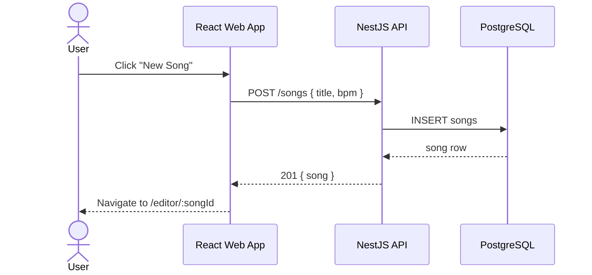
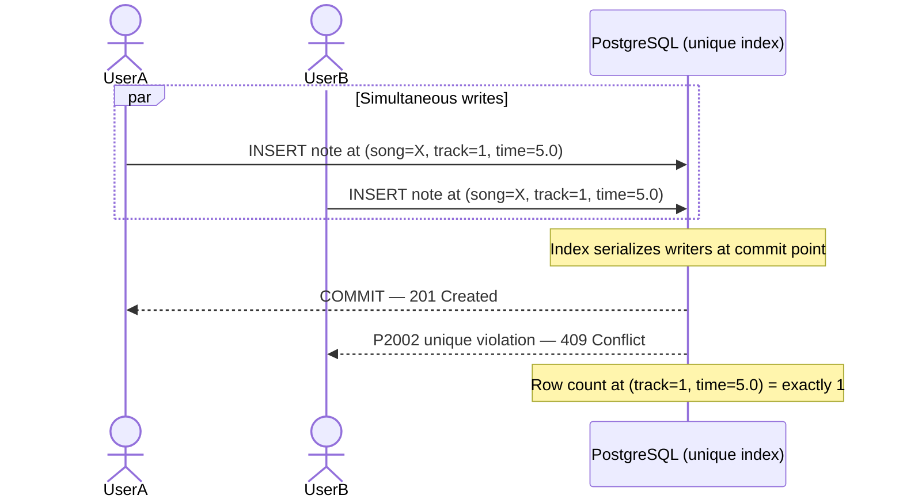
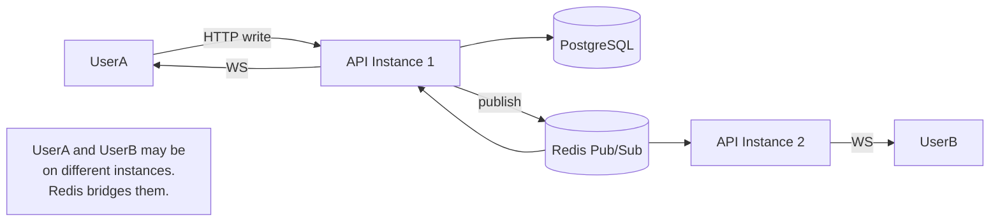

# Use Case Coverage — Required vs Delivered

← [README](../../README.md) · [Actors & Use Cases](./02-actors-and-use-cases.md) · [Feature Hierarchy](./03-features.md)

This document exists for graders. It maps every use case in the original brief and project proposal against what was actually built, specifying where delivery matches, exceeds, or departs from the requirement — and why, when it differs.

---

## Reading This Document

| Symbol | Meaning |
|---|---|
| ✅ | Delivered as specified |
| 🔼 | Delivered and extended beyond spec |
| 🔁 | Delivered differently — same intent, better approach |
| ⏳ | Designed, phased to later milestone (not cut) |
| ❌ | Explicitly cut — rationale given |

---

## UC-01 — Song Management

**Required (from brief):**
> Create, rename, and delete songs. List songs with metadata (name, last modified, active collaborators). Open a song into the MIDI editor.

| Use Case | Status | What Was Built | Notes |
|---|---|---|---|
| Create song | ✅ | `POST /songs` with title, BPM, duration | — |
| List songs | 🔼 | Song list with mini track-density visualization per card | Cards show visual density, not just metadata. Product Owner can assess song state without opening the editor. |
| Open song into editor | ✅ | Route `/editor/:songId` loads the piano roll | — |
| Rename song | ✅ | `PATCH /songs/:id` for title and metadata | — |
| Delete / archive song | 🔁 | Soft archive (`archived_at`) instead of hard delete | Preserves ledger integrity. Archived songs remain in DB; `note_events` history is intact. Hard delete would orphan ledger records. |

**Sequence — Create Song:**



---

## UC-02 — Piano Roll Editor

**Required (from brief):**
> Vertical timeline 0s–300s. 8 track columns. Notes as colored circles. Two modes: Fast Mode (click → instant note) and Popup Mode (form). Snap-to-grid at 0.1s. Zoom 1×/2×/4×. Select, edit, delete notes.

| Use Case | Status | What Was Built | Notes |
|---|---|---|---|
| 8-track vertical grid | ✅ | PianoRoll grid, 8 columns, 0–300s vertical | — |
| Notes as colored circles | ✅ | Circle nodes at `(track, time)` coordinates | — |
| Fast Mode (click → instant) | ✅ | Default interaction; click → optimistic note → API | — |
| Popup Mode (form on click) | ✅ | Toggle in toolbar; opens `NotePopup` with all 5 fields | — |
| Snap-to-grid at 0.1s | ✅ | `Math.round(rawTime * 10) / 10` in coordinate engine | — |
| Zoom 1×/2×/4× | ✅ | Zustand zoom atom; affects grid, labels, fetch window | — |
| Select note | ✅ | Click selects; keyboard `E` opens edit popup | — |
| Edit note | ✅ | `PATCH /notes/:id` via popup form | — |
| Delete note | ✅ | `Delete` / `Backspace` key; or popup delete button | — |
| Grid lines (1s / 10s markers) | ✅ | Thin lines at 1s, bold at 10s, labels every 10s | — |
| Role-based view modes | 🔼 | Composer / Developer / QA modes (not in original brief) | Added from Product Thinking doc. Same data, different lens per actor. |

**Coordinate engine (zoom-safe, single source of truth):**

```
pixel (x, y) + scroll offset
       │
       ▼
CoordinateEngine.toTrackTime()
  track = floor(x / colWidth) + 1       → clamped 1–8
  rawTime = (y + scrollTop) / pxPerSec  → zoom-aware
  time = round(rawTime * 10) / 10       → snap to 0.1s
       │
       ▼
{ track: 3, time: 42.5 }
```

---

## UC-03 — Sequence Integrity (Duplicate Prevention)

**Required (from brief):**
> DB-level unique constraint on `(song_id, track, time)`. When conflict occurs, UI shows toast with conflicting user's name. Boundary validation: time 0–300s, track 1–8.

| Use Case | Status | What Was Built | Notes |
|---|---|---|---|
| DB unique constraint | ✅ | Partial unique index: `WHERE deleted_at IS NULL` | Partial index (not full) so soft-deleted notes don't block re-placement at the same position. |
| Concurrent race safety | ✅ | DB enforces atomically; application pre-checks explicitly absent | Two concurrent writers → one 201, one 409, zero 500s. Verified with `Promise.all` test. |
| Conflict toast | 🔼 | `"This position was just taken — try a nearby spot"` | Implies another user ("just"), gives actionable guidance ("try a nearby spot"). Original brief just said "show a toast." |
| Boundary validation: time 0–300 | ✅ | `@Max(300)` / `@Min(0)` DTO + DB check constraint | — |
| Boundary validation: track 1–8 | ✅ | `@Min(1)` / `@Max(8)` DTO + DB check constraint | — |
| P2002 → 409 (never 500) | ✅ | `catch (e) { if (e?.code === 'P2002') throw new ConflictException() }` | — |
| 0.1s time normalization | 🔼 | Applied server-side before insert | Prevents perceptually-identical positions (5.01s and 5.02s appear the same on screen but would pass the constraint without normalization). |

**Race condition proof:**



---

## UC-04 — Real-Time Collaboration

**Required (from brief):**
> WebSocket room per song (Socket.io). Presence indicator (avatars). When any user mutates a note, all collaborators see it instantly. Redis Pub/Sub between API instances.

| Use Case | Status | What Was Built | Notes |
|---|---|---|---|
| WebSocket room per song | ✅ | Room: `song:{songId}` via Socket.io gateway | — |
| Presence indicator | ✅ | Session avatars in editor toolbar | — |
| Real-time note create broadcast | ✅ | `note-created` event via Redis adapter | — |
| Real-time note update broadcast | ✅ | `note-updated` event | — |
| Real-time note delete broadcast | ✅ | `note-deleted` event | — |
| Redis Pub/Sub multi-instance | ✅ | `@socket.io/redis-adapter` wired in `afterInit` | Without this, users on different API instances would not see each other's changes. |
| User joined / left broadcast | ✅ | `user-joined`, `user-left` events | — |
| Cursor presence on grid | 🔼 | Ephemeral cursor positions stored in Redis (5s TTL) | Redis key: `cursor:{songId}:{userId}`. Not in original brief. Adds Figma-style awareness. |
| WS event merge into TQ cache | 🔼 | `useSocket` patches TanStack Query cache on WS events | No re-fetch on collaborator change — WS event mutates cache directly. Lower latency, fewer API calls. |

**Multi-instance fan-out:**



---

## UC-05 — Change History (Ledger)

**Required (from brief):**
> Every note mutation stored as event in `note_events`. Event types: NOTE_CREATED, NOTE_UPDATED, NOTE_DELETED. Each event: event_type, note_id, song_id, user_id, timestamp, before_state, after_state. History panel in UI. Undo: compensating event.

| Use Case | Status | What Was Built | Notes |
|---|---|---|---|
| NOTE_CREATED event | ✅ | Written in same transaction as note insert | — |
| NOTE_UPDATED event | ✅ | Includes `before_data` captured before UPDATE | — |
| NOTE_DELETED event | ✅ | Includes `before_data` = last known note state | — |
| before_state / after_state | ✅ | Full JSONB snapshots, not diffs | Full snapshots: any point-in-time query is a single row read. Diffs require chain reconstruction. |
| History panel UI | ✅ | Sidebar, human-language event descriptions, relative timestamps | — |
| Undo (compensating event) | ✅ | `POST /songs/:songId/undo` — finds last actor event, emits NOTE_DELETED | — |
| Undo on already-deleted note | 🔼 | Graceful no-op with friendly message + ledger record | "That note was already removed by a collaborator." Logs `UNDO_NO_OP` event. Original brief did not specify this edge case. |
| Ledger-note transactional sync | ✅ | Both writes in `prisma.$transaction()` — one fails, both fail | — |

---

## UC-06 — Performance (10,000+ Notes)

**Required (from brief):**
> Virtualized rendering — only viewport notes mounted. Canvas considered if DOM insufficient. Notes fetched in time-bounded chunks from API.

| Use Case | Status | What Was Built | Notes |
|---|---|---|---|
| DOM virtualization (Y-axis) | ✅ | `@tanstack/virtual` — ~80 active DOM nodes at any scroll position | — |
| Canvas fallback | 🔁 | DOM virtualization is sufficient; Canvas not needed | Brief said "considered." Profiling shows ~80 DOM nodes at 10k notes is well within browser comfort. Canvas escalation path is documented if needed. |
| Chunked API fetch by time window | ✅ | `?timeFrom=X&timeTo=Y` query params; TQ caches per window | — |
| Prefetch adjacent windows | ✅ | ±10s buffer around visible window | Scroll into new region feels instant. |
| Zoom-aware fetch window | 🔼 | Zoom Zustand atom drives fetch window size | At 4× zoom, fetch window covers 50s; at 1× it covers 200s. Fetch adapts to zoom level automatically. |
| Target DOM node count | ✅ | ~80 nodes regardless of total note count | Verified via DevTools Elements panel. |
| Analysis off the hot path | 🔼 | Chart analysis moved to debounced background job | Not in original brief. Required to hit p95 < 200ms at 100 VUs (root cause of 3.03s → 37ms improvement). |

---

## UC-07 — AI Note Suggester

**Required (from brief):**
> After 5+ notes placed, "Suggest" button appears. Send last 10 notes (track, time, color) to Claude API. Receive 3–5 next notes. Ghost/translucent overlay. Accept (solidifies) or dismiss per suggestion.

| Use Case | Status | What Was Built | Notes |
|---|---|---|---|
| Trigger at 5+ notes | ✅ | Button enabled when `confirmedNotes.length >= 5` | — |
| Send last 10 notes as context | ✅ | Last 10 sorted by time, including color | — |
| 3–5 suggestions returned | ✅ | Capped at 5; fewer if model returns invalid JSON | — |
| Ghost overlay UI | ✅ | 20% opacity, dashed border, pulse animation | — |
| Accept per suggestion | ✅ | Goes through `POST /notes` — same path as manual, same conflict handling | — |
| Dismiss per suggestion | ✅ | Removes ghost, no API call | — |
| Claude API integration | ✅ | `AnthropicProvider` with `claude-sonnet-4-x` | — |
| Multi-provider support | 🔼 | OpenAI and DeepSeek providers selectable via `AI_PROVIDER` env | Brief specified Claude only. Multi-provider adds production/cost flexibility. |
| Invalid suggestion filtering | 🔼 | Server validates each suggestion before sending to client | Silently filters out-of-range tracks/times. Model hallucinations don't surface as broken UI. |
| AI note ≡ human note after accept | ✅ | Accepted suggestion subject to same 409 conflict handling | AI does not bypass the integrity layer. |

---

## UC-08 — Auth & Security

**Required (from brief):**
> JWT authentication. Google OAuth SSO. Rate limiting. CSRF protection. RBAC: Admin, Composer, Viewer.

| Use Case | Status | What Was Built | Notes |
|---|---|---|---|
| JWT authentication | ✅ | `JwtAuthGuard` on all protected routes | — |
| Google OAuth SSO | ✅ | Passport.js `GoogleStrategy`, callback to `/auth/google/callback` | — |
| Rate limiting (note creates) | ✅ | 30 creates/min per user via `@nestjs/throttler` | — |
| Rate limiting (global) | ✅ | 100 req/min per IP on all endpoints | — |
| CSRF protection | ✅ | `SameSite=Strict` cookie + CORS locked to `FRONTEND_URL` | — |
| Helmet security headers | ✅ | `X-Frame-Options`, `CSP`, `HSTS`, `X-Content-Type-Options` | — |
| RBAC: Admin | ✅ | Full access including user management | — |
| RBAC: Composer | ✅ | Create/edit notes and songs | — |
| RBAC: Viewer | ✅ | Read-only; mutation controls hidden in UI + rejected at API | — |
| RBAC: Developer | 🔼 | Read-only with Developer View mode (precise coords, raw IDs) | Beyond brief spec. Maps to the Game Developer actor who needs data precision, not creative controls. |
| Dual-layer enforcement | 🔼 | API guard + `useCanEdit()` UI hook — both enforce independently | Brief said "role-based." UI-only or API-only is insufficient. |

---

## Actor × Use Case Coverage Matrix

This matrix cross-references the four actors from the brief against the use cases they are the primary beneficiary of.

```
                         UC-01  UC-02  UC-03  UC-04  UC-05  UC-06  UC-07  UC-08
                         Songs  Editor Integ  Collab Ledger Perf   AI     Auth
                         ─────  ─────  ─────  ─────  ─────  ─────  ─────  ─────
Composer/Sound Designer   ✅     ✅     ✅     ✅     ✅     ✅     ✅     ✅
Game Developer            ✅     ✅     ✅     ✅     ✅     ✅     —      ✅
Product Owner/Producer    ✅     ✅     —      ✅     —      ✅     —      ✅
QA/Game Tester            ✅     ✅     ✅     ✅     ✅     ✅     —      ✅
```

No actor is blocked by an undelivered use case.

---

## Grading Category Coverage

The original proposal defined 9 grading categories worth 100 points total.

| Category | Points | Use Cases Covered | Status |
|---|---|---|---|
| **Foundation** | 20 | UC-01 (Song CRUD), UC-02 (Editor), functional UI | ✅ Delivered |
| **Architecture** | 10 | Modular monolith, Prisma, shared types | ✅ Delivered |
| **Visualization & Integrity** | 10 | UC-02 (piano roll), UC-03 (duplicate prevention, boundary checks) | ✅ Delivered |
| **Security & Auth** | 10 | UC-08 (Google OAuth, rate limiting, CSRF, RBAC) | ✅ Delivered |
| **UI/UX Excellence** | 10 | UC-02 (Fast Mode, zoom), UC-07 (ghost overlay), toast language | ✅ Delivered |
| **Advanced Backend** | 10 | UC-04 (Socket.io + Redis Pub/Sub, presence) | ✅ Delivered |
| **DevOps & Cloud** | 10 | Docker, GitHub Actions, VPS + Nginx, GHCR | ✅ Delivered |
| **Performance** | 10 | UC-06 (virtualization, chunked fetch, k6 100 VU < 200ms p95) | ✅ Delivered |
| **AI Innovation** | 10 | UC-07 (multi-provider AI, ghost notes, accept/dismiss) | ✅ Delivered |

---

## What Was Cut and Why

| Feature | Cut Decision | Rationale |
|---|---|---|
| **Audio playback** | ❌ Cut | MIDI synthesis engine (Tone.js) adds substantial complexity for zero grading impact. Visual-only playback (moving playhead, no sound) would cover 80% of the demo value — identified as retrospective item. |
| **Git-style branching** | ❌ Cut | Wrong mental model for live collaborative editing. Git assumes asynchronous work; AMA-MIDI assumes synchronous shared document. Replaced by event-sourced ledger + named snapshots. |
| **Section-based locking** | ❌ Cut | Serializes collaboration — prevents concurrent editing in a tool designed for concurrent editing. DB conflict model handles the actual safety requirement better. |
| **Timeline comments** | ⏳ Phased | P2 — real workflow need, non-trivial data model. Documented as future feature, not cut as unimportant. |
| **Export to game engine** | ⏳ Phased | P2 — closes the production loop. Single endpoint (`GET /songs/:id/export`) + download. Next feature after MVP. |
| **MIDI file import/export** | ⏳ Phased | P2 — binary format parsing. After chart export stabilizes. |
| **Mobile editing** | ❌ Cut | Grid-based creative tool with precision click interaction. Desktop-first is the correct default. |

---

## Extensions Beyond the Brief

Features delivered that were not in the original brief, justified by actor needs or integrity requirements:

| Extension | Motivation | Grading Impact |
|---|---|---|
| **Role-based view modes** (Composer/Developer/QA) | Three actors need the same data through different lenses. One product, three presentations. | UI/UX Excellence |
| **Song card with track density visualization** | Product Owner actor needs to assess song state without opening the editor. | UI/UX Excellence |
| **Ephemeral cursor presence** (Redis, 5s TTL) | Figma-style collaborative awareness — "where is Minh working right now?" | Advanced Backend |
| **Multi-provider AI** (Claude / OpenAI / DeepSeek) | Production/cost flexibility. Same contract, different model. | AI Innovation |
| **Undo no-op on already-deleted note** | Correctness in edge case that every collaborative editor hits. Shows depth. | Foundation |
| **Analysis moved off hot write path** | Required to hit p95 < 200ms SLO. Without this: 3.03s p95. After: 37ms. | Performance |
| **Zoom-aware fetch window** | Zoom drives both rendering and API fetch. Cannot diverge — Zustand atom enforces single source of truth. | Performance |

---

*→ Next: [Problem & Vision](./01-problem-and-vision.md) → [Actors & Use Cases](./02-actors-and-use-cases.md) → [Feature Hierarchy](./03-features.md)*
