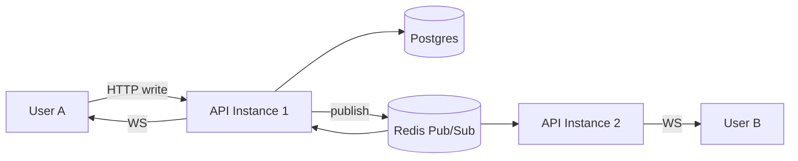
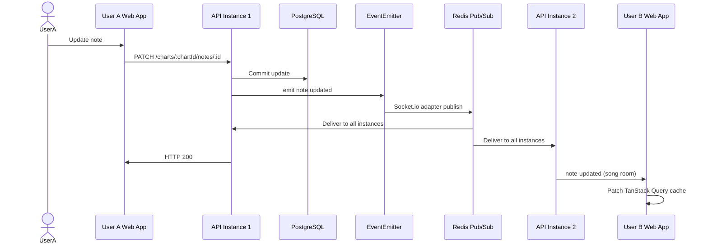

# Realtime Architecture (Redis & WebSocket)

← [README](../../README.md) · [Feature List ERD](../../initial_document/feature_list_erd.md) · [Architecture & System Design](./05-architecture.md) · [Major Feature Workflows](./06-workflows.md)

---

Redis in AMA-MIDI is **only for realtime collaboration** — not notes, auth, or caching. Postgres remains the source of truth for all chart data.

---

## Two jobs Redis does

### 1. Socket.io adapter — multi-instance WebSocket fan-out

This is the main role.

When User A creates a note, the flow is:

```text
HTTP POST → API instance 1
         → Postgres commit
         → RealtimeListener emits note-created
         → Socket.io broadcasts to song room
```

If you run **multiple API containers** behind a load balancer, User B might be connected to **instance 2**. Without Redis, instance 1's broadcast never reaches them.

Redis fixes that via the Socket.io Redis adapter wired in `RealtimeGateway`:

```typescript
// apps/api/src/modules/realtime/realtime.gateway.ts
async afterInit(server: Server) {
  const redisUrl  = process.env.REDIS_URL || 'redis://localhost:6379'
  const pubClient = new Redis(redisUrl)
  const subClient = pubClient.duplicate()
  server.adapter(createAdapter(pubClient, subClient))
}
```



Events that cross instances this way include:

- `note-created`, `note-updated`, `note-deleted`
- `notes-batch-applied`
- `chart-analysis-updated`
- `user-joined`, `user-left`
- `cursor-moved`, `cursor-hidden`
- `chart-switched`

**Redis is a message bus between API instances**, not a database for notes.

#### End-to-end collaboration sync



---

### 2. Ephemeral cursor storage

Collaborator cursors are too frequent and too transient for Postgres. They live in Redis with a **5-second TTL**:

```typescript
// apps/api/src/modules/realtime/cursor.service.ts
async setCursor(songId: string, userId: string, data: StoredCursor): Promise<void> {
  await this.redis.set(this.key(songId, userId), JSON.stringify(data), 'EX', 5)
}
```

Key pattern: `cursor:{songId}:{userId}`

| Action | What happens |
|---|---|
| User moves cursor | Write to Redis (fire-and-forget) + broadcast `cursor-moved` |
| New user joins song | Read all cursors from Redis → send `cursor-snapshot` |
| User leaves / disconnects | Delete their cursor key |

If Redis loses a cursor key, the worst case is a missing cursor until they move again — not corrupted chart data.

---

## What Redis does **not** do

| Concern | Actual store |
|---|---|
| Notes, charts, songs | **PostgreSQL** |
| History / undo ledger | **PostgreSQL** (`editor_events`, `editor_commands`) |
| Auth sessions / JWT | **JWT in client** (stateless) |
| Rate limiting | **In-memory** (`@nestjs/throttler`) |
| Note query cache | **TanStack Query** (browser) |
| Presence list | **PostgreSQL** (`editor_sessions` table) |
| Job queue (analysis, AI) | **In-process** debounce in NestJS |

Redis is not on the note write path. A note create goes: validate → Postgres → internal event → WebSocket. Redis only appears when Socket.io needs to relay that event across instances, or when storing a cursor.

---

## WebSocket room model

| Room | Scope | Used for |
|---|---|---|
| `song:{songId}` | All editors on this song | Note events, cursors, presence |
| `project:{projectId}` | Project members | Member changes, access updates |

**Note:** WebSocket rooms are **song-scoped**, but note payloads include `chartId`. The frontend patches the correct chart's TanStack Query cache (`useSocket` in `apps/web/src/features/collaboration/useSocket.ts`).

### Connection lifecycle

```text
Browser                          API (Socket.io + Redis adapter)
   │                                      │
   ├─ connect with JWT in auth ──────────►│ verify token + tokenVersion
   │◄──────────── authenticated ──────────┤
   ├─ emit join-song { songId } ─────────►│ join room song:{songId}
   ├─ emit join-project { projectId } ───►│ join room project:{projectId}
   ├─ emit cursor-move { track, time } ──►│ Redis write + broadcast cursor-moved
   │◄──────── note-created / updated ──────┤ (from other users)
```

---

## Why Redis fits here

| Property | Why it matters |
|---|---|
| **Pub/Sub** | Perfect for "tell all API instances about this event" |
| **Fast, in-memory** | Cursor updates happen many times per second |
| **TTL** | Cursors auto-expire; no cleanup job needed |
| **Ephemeral by design** | Losing cursor data is acceptable; losing notes is not |

---

## Single instance vs scaled

| Setup | Redis still needed? |
|---|---|
| **1 API container** (local dev, small VPS) | Adapter still works; mainly enables cursor storage + future scale |
| **2+ API containers** (load balanced) | **Required** — without it, realtime breaks across instances |

In production, Redis runs as a Docker service (`redis:7-alpine`) on the internal network only — not exposed to the public internet. The API connects via `REDIS_URL=redis://redis:6379`.

---

## Internal event bus (how writes reach WebSocket)

Note mutations do not call the WebSocket gateway directly. They emit domain events; `RealtimeListener` reacts:

```text
NotesService.create()
    │
    ├─► INSERT into Postgres
    ├─► EditorCommandService.record()
    └─► emit('note.created', { songId, noteId, afterState, ... })
              │
              ├──► LedgerListener      → writes editor_events row
              └──► RealtimeListener    → broadcastToSong via Socket.io → Redis adapter
```

Event names live in `packages/shared/src/events.ts`.

---

## One-line summary

**Redis = realtime glue:** it lets every API instance broadcast WebSocket events to the right clients, and it holds short-lived cursor positions. Everything that must never be lost lives in Postgres.
