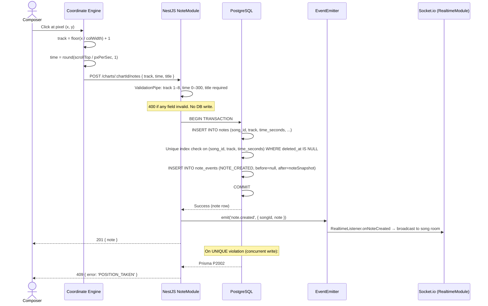
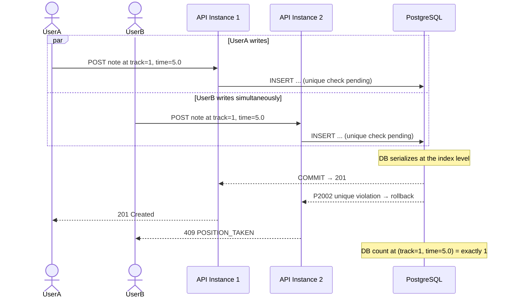
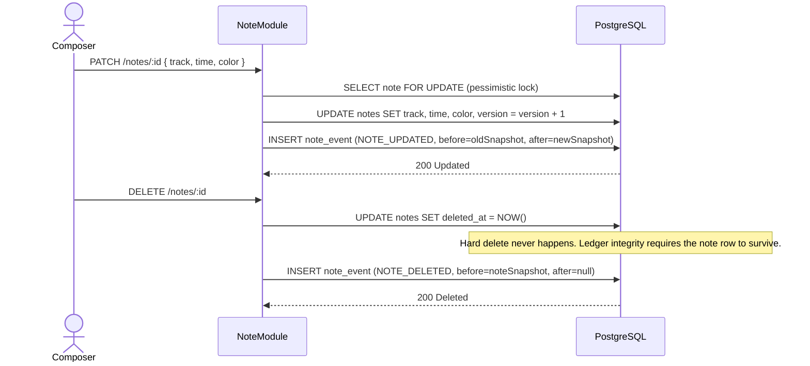

# F01 — Note CRUD & Duplicate Prevention

← [README](../../../README.md) · [Feature List](../03-features.md) · [Architecture](../05-architecture.md) · [Workflows](../06-workflows.md)

---

## What This Feature Does

The note creation and management loop is the core action of AMA-MIDI. A composer clicks a position on the piano roll grid, and a note appears instantly. Behind that click is a full write pipeline: coordinate conversion, validation, a transactional DB insert with atomic duplicate detection, a ledger write, and a WebSocket broadcast to all collaborators.

The duplicate prevention is not a separate feature — it is embedded in the write path and enforced at the database layer, so it cannot be circumvented regardless of how many users write simultaneously.

---

## Why We Built It This Way

### The Problem With Application-Level Checks

The intuitive approach: before inserting, query whether a note already exists at `(song_id, track, time)`. If yes, return 409. This is how most CRUD apps handle it.

It breaks under concurrency.

Two composers click the same position at the same instant. Both requests reach the service layer. Both run the pre-check query. Both see "no note exists" — because neither insert has committed yet. Both proceed. Both succeed. The database now has two notes at the same position. The song's data is corrupted.

This is not a theoretical edge case in a real-time collaborative tool. It is the normal operating condition.

### The Correct Answer: DB Unique Constraint

```sql
CREATE UNIQUE INDEX uq_notes_song_track_time_active
ON notes (song_id, track, time_seconds)
WHERE deleted_at IS NULL;
```

This partial unique index is enforced by the database engine atomically at the point of write. One insert wins. The other fails with a unique constraint violation — deterministically, regardless of timing. No application code can replicate this guarantee.

The `WHERE deleted_at IS NULL` partial condition means soft-deleted notes don't block new notes at the same position. A composer can delete a note and re-place it at the same spot — the ledger records both events, and the constraint only applies to active notes.

---

## How It Works

### Full Write Flow



### Conflict Path — Concurrent Race



### Note Update & Soft Delete



---

## Implementation Reference

### Note Schema (Critical Fields)

```typescript
// apps/api/prisma/schema.prisma

model Note {
  id          String    @id @default(cuid())
  songId      String
  track       Int       // 1–8
  time        Float     // 0–300, stored as 0.1s resolution
  title       String
  color       String
  createdBy   String
  version     Int       @default(1)
  deletedAt   DateTime? // soft delete; null = active

  @@unique([songId, track, time], map: "uq_notes_song_track_time_active")
  // Prisma translates this to a partial index in migration SQL
}
```

### Error Mapping (P2002 → 409)

```typescript
// apps/api/src/modules/notes/notes.service.ts

async create(songId: string, dto: CreateNoteDto, actorId: string) {
  try {
    return await this.prisma.$transaction(async (tx) => {
      const note = await tx.note.create({ data: { songId, ...dto } })
      await this.ledger.record(tx, { type: 'NOTE_CREATED', noteId: note.id, actorId, afterState: note })
      return note
    })
  } catch (e) {
    if (e?.code === 'P2002') {
      throw new ConflictException('POSITION_TAKEN')
    }
    throw e
  }
}
```

### Boundary Validation (DTO)

```typescript
// apps/api/src/modules/notes/dto/create-note.dto.ts

export class CreateNoteDto {
  @IsString()
  @IsNotEmpty()
  title: string

  @IsInt()
  @Min(1)
  @Max(8)
  track: number

  @IsNumber()
  @Min(0)
  @Max(300)
  time: number  // rounded to 1 decimal before insert

  @IsString()
  color: string
}
```

### Time Rounding (Prevents Perceptually Identical Positions)

```typescript
// apps/api/src/modules/notes/notes.service.ts

private normalizeTime(time: number): number {
  return Math.round(time * 10) / 10  // snap to 0.1s resolution
}
```

Without this, notes at `5.01s` and `5.02s` are distinct in the DB but visually identical on screen. The unique index would allow both. With 0.1s normalization, both round to `5.0s` and the second insert fails cleanly.

---

## Validation Rules (Complete)

| Field | Rule | HTTP response on violation |
|---|---|---|
| `track` | Integer 1–8 | 400 with `track must be between 1 and 8` |
| `time` | Float 0–300, 0.1s resolution | 400 with `time must not be greater than 300` |
| `title` | Required string | 400 with `title should not be empty` |
| `color` | Valid hex or named color | 400 with validation message |
| `(song, track, time)` active duplicate | Unique constraint | 409 with `POSITION_TAKEN` |
| Permission | Must be Composer or Admin | 403 |

---

## Trade-offs & Decisions

### Why 0.1s Resolution (Not Milliseconds)

Millisecond precision allows `5.001s` and `5.002s` — positions that appear pixel-identical on screen but are stored as different rows. The unique index would allow both. The editor would render them overlapping. The UX is confusing and the data is effectively wrong.

0.1s is precise enough for game soundtrack prototyping. The snap grid enforces what the constraint guarantees. Clean data model, no visual ambiguity.

### Why Soft Deletes (Not Hard Deletes)

The ledger records `note_events` with a `note_id` foreign key. Hard-deleting a note would orphan its history records (or require `ON DELETE CASCADE` which destroys the audit trail). Soft delete (`deleted_at`) keeps the note row alive for ledger integrity while making it invisible to active queries and the unique index.

The partial unique index `WHERE deleted_at IS NULL` means a soft-deleted note at position `(1, 5.0)` does not block a new note at the same position. The position is re-usable after deletion.

### Why No Optimistic Concurrency Version Check on Create

Version-based optimistic concurrency (check `version`, fail if it doesn't match) is correct for updates — you're asserting "I have the latest state of this note." For creates, there is no prior version to check. The unique constraint handles the concurrent-create race correctly without version fields.

---

## Later Scale

**Current:** Single DB instance handles all inserts; unique index enforces correctness.

**At higher write volume (thousands of notes/sec):**
- **Read replicas** for `GET /notes` queries (all reads can route to replicas; writes stay on primary)
- **Partitioning by `song_id`** — if songs are isolated, partition the notes table by `song_id` hash. Each partition has its own index; conflict detection still works within a partition.
- **Sharding by song** — at extreme scale, each song's notes live in a shard. Cross-shard conflicts don't exist (each song is isolated). The unique constraint still holds per-shard.

**The constraint approach does not limit horizontal scale** because note position conflicts are always within a single song. A note at `(song_A, track_1, 5.0)` and `(song_B, track_1, 5.0)` are never in conflict — they are different songs. Sharding by `song_id` preserves the correctness guarantee while distributing load.

---

*→ See also: [Realtime Architecture](../Realtime.md) for how note-created events are broadcast, [Change History](./F02-change-history-ledger.md) for ledger write details, [Optimistic UI](./F03-optimistic-ui.md) for the client-side ghost note pattern.*
