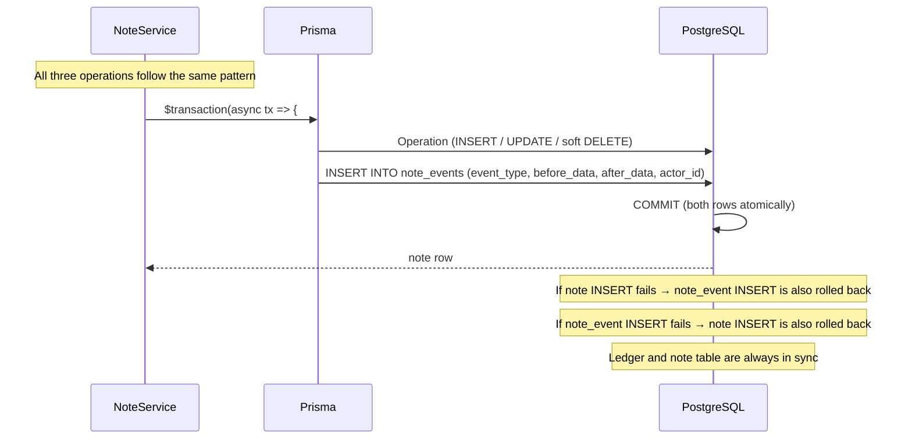
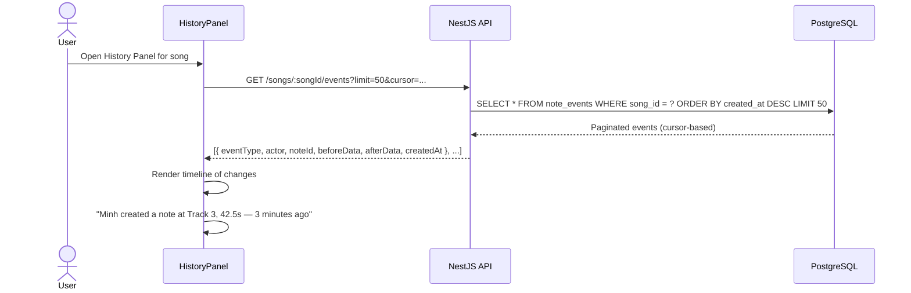
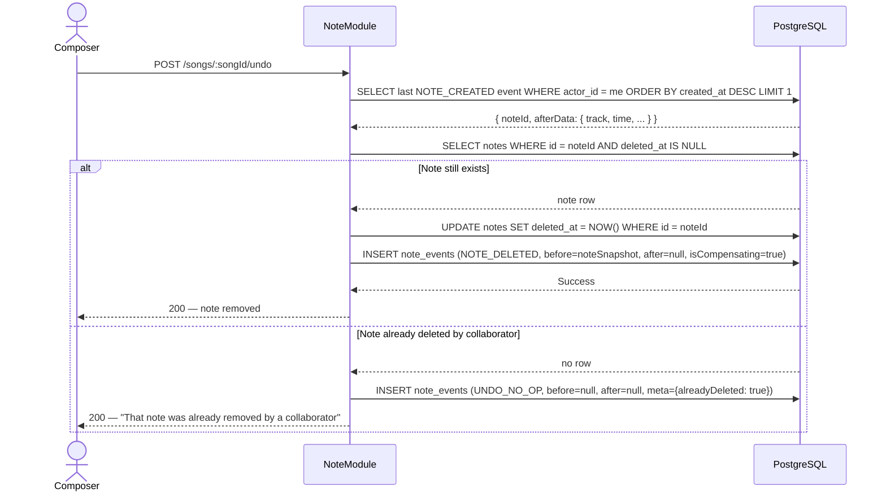

# F02 — Change History & Event Ledger

← [README](../../../README.md) · [Feature List](../03-features.md) · [Architecture](../05-architecture.md)

---

## What This Feature Does

Every note mutation — create, update, delete — appends an immutable record to the `note_events` table. Each record captures who did it, when, what the note looked like before, and what it looks like after (stored as JSONB snapshots). This ledger is the audit trail, the history panel data source, and the foundation for undo.

Undo is not a state rollback. It is a new compensating event: to undo a `NOTE_CREATED`, the system creates a `NOTE_DELETED` event. The ledger always grows; history is never mutated.

---

## The Problem This Solves

In a live collaborative editor, questions come up constantly:
- Who moved that note?
- What did this section look like 20 minutes ago?
- Why did that note disappear?

Without a ledger, the answers are lost. With a version field alone (`updated_at`, `version`), you know a note changed but not what it looked like before or who changed it.

The ledger also solves a specific product question: **what does undo mean in a multi-user session?** If User A creates a note and User B deletes it, what should User A's undo do? The ledger gives the system enough information to answer that question correctly without user confusion.

---

## Design Decision: Event Sourcing vs Git-Style Branching

The "history" requirement could have been implemented several ways.

**Git-style branching** was the first considered alternative. Composers could work on experimental versions without affecting the main sequence. This is genuinely useful. But the mental model is wrong for a live collaborative editor.

Git is designed for asynchronous individual work: you write changes, commit, push, someone reviews, merges. A live editor is the opposite — multiple people working synchronously on a single shared document. In a live editor, there is no "branch." Everyone is always on `main`. Branching would require locking sections of the timeline while someone works, which reintroduces exactly the collaborative friction AMA-MIDI is designed to eliminate.

**Event sourcing** matches the actual semantics. A note being placed is a fact that happened. An event has real meaning: who did it, when, what it looked like before, what it looks like after. An append-only ledger captures this naturally. Undo is appending a compensating event — the history record of the reversal is itself part of the history.

---

## Data Model

```
note_events
  id          UUID PK
  song_id     UUID FK → songs (for song-scoped history queries)
  note_id     UUID FK → notes (nullable — SET NULL on note hard-delete, which never happens)
  actor_id    UUID FK → users
  event_type  VARCHAR  — NOTE_CREATED | NOTE_UPDATED | NOTE_DELETED
  before_data JSONB    — full note snapshot before the mutation (null on create)
  after_data  JSONB    — full note snapshot after the mutation (null on delete)
  created_at  TIMESTAMPTZ
```

**Why full JSONB snapshots instead of diffs?**

Storing full snapshots makes history queries trivial: "what did this note look like before this event?" is a single row read. Diff chains require reconstructing state incrementally from event N back to event 0. As the chain grows, reconstruction becomes slower and more complex. Full snapshots trade storage for simplicity and query performance.

The typical snapshot size (one note's fields: ~200 bytes) is negligible compared to the query complexity saved.

---

## How It Works

### Write Flow (Every Mutation)



**Create:**
```
event_type = 'NOTE_CREATED'
before_data = null
after_data  = { id, track, time, color, title, createdBy, ... }
```

**Update:**
```
event_type = 'NOTE_UPDATED'
before_data = { id, track, time, color, title, ... }  ← captured before UPDATE
after_data  = { id, track, time, color, title, ... }  ← new values
```

**Delete (soft):**
```
event_type = 'NOTE_DELETED'
before_data = { id, track, time, color, title, ... }  ← last known state
after_data  = null
```

### History Panel Query



### Undo Flow



The "already deleted" case is a deliberate product decision. Throwing an error would be confusing — the composer's intent (undo their last action) is satisfied because the note is gone. Logging the undo attempt with metadata keeps the ledger complete.

---

## Implementation Reference

### Transaction Pattern

```typescript
// apps/api/src/modules/notes/notes.service.ts

async create(songId: string, dto: CreateNoteDto, actorId: string) {
  return this.prisma.$transaction(async (tx) => {
    const note = await tx.note.create({
      data: { songId, track: dto.track, time: this.normalizeTime(dto.time), ...dto },
    })

    await tx.noteEvent.create({
      data: {
        songId,
        noteId: note.id,
        actorId,
        eventType: 'NOTE_CREATED',
        beforeData: null,
        afterData: note as unknown as Prisma.JsonValue,
      },
    })

    this.eventEmitter.emit('note.created', { songId, note, actorId })
    return note
  })
}

async delete(noteId: string, actorId: string) {
  return this.prisma.$transaction(async (tx) => {
    const note = await tx.note.findUniqueOrThrow({ where: { id: noteId, deletedAt: null } })

    await tx.note.update({
      where: { id: noteId },
      data: { deletedAt: new Date() },
    })

    await tx.noteEvent.create({
      data: {
        songId: note.songId,
        noteId: note.id,
        actorId,
        eventType: 'NOTE_DELETED',
        beforeData: note as unknown as Prisma.JsonValue,
        afterData: null,
      },
    })

    this.eventEmitter.emit('note.deleted', { songId: note.songId, noteId, actorId })
  })
}
```

### Undo Service

```typescript
// apps/api/src/modules/notes/undo.service.ts

async undo(songId: string, actorId: string) {
  const lastEvent = await this.prisma.noteEvent.findFirst({
    where: { songId, actorId, eventType: 'NOTE_CREATED' },
    orderBy: { createdAt: 'desc' },
  })

  if (!lastEvent) return { message: 'Nothing to undo' }

  const note = await this.prisma.note.findUnique({
    where: { id: lastEvent.noteId, deletedAt: null },
  })

  if (!note) {
    // Log no-op but do not throw — collaborator already removed it
    await this.prisma.noteEvent.create({
      data: { songId, actorId, eventType: 'UNDO_NO_OP', beforeData: null, afterData: null },
    })
    return { message: 'That note was already removed by a collaborator' }
  }

  return this.notesService.delete(note.id, actorId)
}
```

---

## Invariants

1. **Every note mutation writes a `NoteEvent` in the same transaction.** If the note write fails, the event write is also rolled back. If the event write fails, the note write is also rolled back. They are always in sync.
2. **Notes are never hard-deleted.** `deleted_at` is set; the row survives for ledger integrity. Hard deletes would orphan `note_events` rows.
3. **Compensating events are real events.** An undo is recorded in the ledger. The history panel shows both the original action and the compensating reversal.

---

## Trade-offs

| Decision | Trade-off |
|---|---|
| **Full JSONB snapshots** | Larger row size vs trivial point-in-time queries. Acceptable for notes (~200 bytes each). |
| **Append-only ledger** | History is always complete, never mutated. Cannot "forget" an event — deliberate. |
| **Per-user undo (not global)** | Simpler model. Does not handle "undo User B's action" as Admin. A global undo stack would require ordering concurrent events, which is a vector clock problem. |
| **No branching** | Cannot experiment without affecting the shared song. Compensated by named version snapshots (Phase 4). |

---

## Later Scale

**Current:** Single `note_events` table, queried by `song_id` + `created_at`.

**At higher volume:**
- **Partition by `song_id`** — history queries are always scoped to one song. Partitioning keeps each partition's index small and queries fast.
- **Archive old events** — events older than 90 days can move to cold storage (S3 + Athena). The live table stays small.
- **Materialized current state** — if "current note state" queries become slow (many events per note), add a materialized view or CQRS read model that stores the latest snapshot. The event log remains the source of truth; the read model is a cache.
- **Streaming to analytics** — `note_events` is naturally a Kafka-compatible event stream. At scale, write events to both Postgres and a Kafka topic to power analytics, ML features (pattern detection), and audit dashboards without querying the transactional DB.

---

*→ See also: [Note CRUD & Duplicate Prevention](./F01-note-crud-duplicate-prevention.md) for the write pipeline, [Optimistic UI](./F03-optimistic-ui.md) for how undo interacts with the frontend state.*
