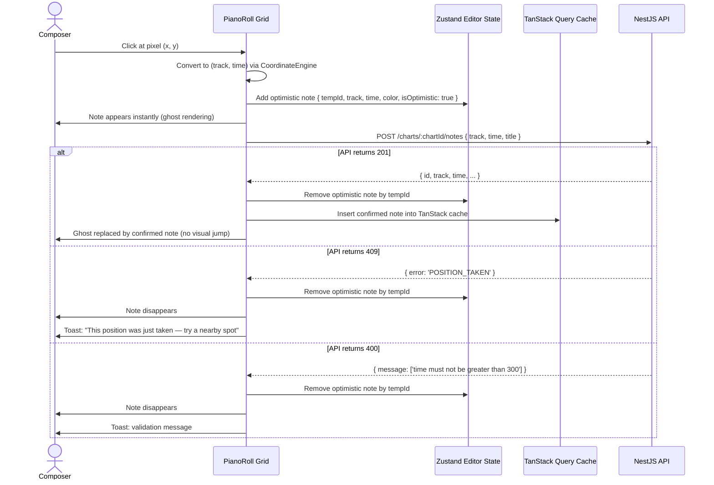
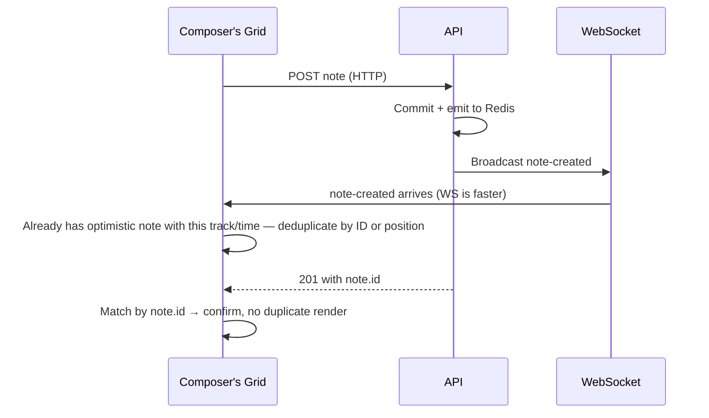

# F03 — Optimistic UI & Conflict Toast

← [README](../../../README.md) · [Feature List](../03-features.md) · [Design Thinking](../04-design-thinking.md)

---

## What This Feature Does

When a composer clicks the piano roll grid, a note appears **instantly** — before the API responds. If the server confirms the write (201), the optimistic note is replaced by the confirmed note. If the server rejects it (409 conflict or 400 validation), the note disappears and a human-readable toast explains why.

The composer never waits for a round trip to see their note. At 30+ notes per minute in Fast Mode, this is the difference between the editor feeling like a creative instrument and feeling like a form.

---

## Why Optimistic UI (Not Server-Wait)

The alternative — show nothing until the API confirms — is simpler. No rollback logic. No transient state. What the user sees is always what the server confirmed.

It's wrong for this use case.

**Composers work in flow states.** When writing a melody, they are translating internal music into clicks. A 150–300ms lag between clicking a position and seeing a note appear (even on a fast connection) interrupts that translation. At 30 clicks per minute, 250ms per click = 7.5 seconds of perceived dead time per minute. The editor feels sluggish. The creative state breaks.

The optimistic model makes the editor feel instant on any connection speed. The rollback path — note disappears, toast explains why — is an edge case in practice. Most create operations succeed. The occasional conflict is resolved with a human-readable message, not a freeze.

---

## State Machine (Single Note Create)

```
IDLE
  │
  ▼
[Composer clicks position]
  │
  ▼
OPTIMISTIC_PLACED
  (ghost note visible, semi-transparent, UUID assigned)
  │
  ├─────────────────────────────────┐
  │ API returns 201                  │ API returns 409 or 4xx
  ▼                                  ▼
CONFIRMED                          ROLLED_BACK
(ghost replaced by real note)      (ghost removed)
                                   (toast shown)
```

---

## How It Works

### Click → Ghost Note → API Call



### WebSocket Race (Optimistic + Real-Time Event)

A subtle case: the composer places an optimistic note, the API succeeds, but before the 201 response arrives, the WebSocket broadcast arrives first (because WS and HTTP are separate channels).



Deduplication guard: TanStack Query merges incoming WebSocket events by note ID. If the optimistic note has a temporary ID and the WS event carries the real ID, the real note replaces the optimistic one without duplication.

---

## Toast Language Design

The language of the conflict toast is a product decision, not a technical one.

| Version | What's wrong |
|---|---|
| `HTTP 409 — POST /charts/:id/notes failed` | Treats the composer as a developer debugging an API. |
| `Position already taken` | Factually correct, but cold. No context, no guidance. |
| `This position was just taken — try a nearby spot` | ✅ Acknowledges what happened, implies another user was involved ("just"), gives actionable guidance. |

"Just taken" carries temporal weight. It tells the composer this was a race — another collaborator was editing the same position at the same moment. It frames the conflict as a collaboration event, not a system failure.

Other toasts follow the same principle:

| Event | Toast text |
|---|---|
| WebSocket disconnects | `Connection lost — reconnecting…` |
| WebSocket reconnects | `Back online — syncing changes` |
| Undo on already-deleted note | `That note was already removed by a collaborator` |
| Rate limit hit (429) | `Slow down — too many notes at once` |

---

## Implementation Reference

### Optimistic State in Zustand

```typescript
// apps/web/src/store/editor.store.ts

interface EditorState {
  optimisticNotes: Map<string, OptimisticNote>  // tempId → note
  addOptimistic: (note: OptimisticNote) => void
  removeOptimistic: (tempId: string) => void
}

interface OptimisticNote {
  tempId: string    // client-generated UUID
  track: number
  time: number
  color: string
  isOptimistic: true
}
```

### Click Handler

```typescript
// apps/web/src/features/editor/PianoRoll.tsx

const handleGridClick = useCallback((e: MouseEvent) => {
  if (!canEdit) return

  const { track, time } = coordinateEngine.toTrackTime(e.offsetX, e.offsetY)
  const tempId = crypto.randomUUID()

  // 1. Show ghost immediately
  addOptimistic({ tempId, track, time, color: activeColor, isOptimistic: true })

  // 2. Fire API call in background
  createNote({ songId, track, time, title: '', color: activeColor })
    .then((confirmedNote) => {
      removeOptimistic(tempId)
      // TanStack Query cache is updated by the mutation's onSuccess
    })
    .catch((err) => {
      removeOptimistic(tempId)
      if (err.status === 409) {
        toast.warning('This position was just taken — try a nearby spot')
      } else {
        toast.error(err.message || 'Something went wrong')
      }
    })
}, [canEdit, coordinateEngine, activeColor, addOptimistic, removeOptimistic, createNote, songId])
```

### Rendering (Real + Optimistic)

```typescript
// apps/web/src/features/editor/NoteLayer.tsx

const allNotes = useMemo(() => [
  ...confirmedNotes,                 // from TanStack Query cache
  ...Array.from(optimisticNotes.values()),  // from Zustand
], [confirmedNotes, optimisticNotes])

// Optimistic notes render at 50% opacity with a dashed border
const noteStyle = (note: Note | OptimisticNote) =>
  note.isOptimistic
    ? { opacity: 0.5, border: '2px dashed currentColor' }
    : { opacity: 1, border: 'none' }
```

---

## Trade-offs

| Decision | Trade-off |
|---|---|
| **Optimistic by default** | Flow state preserved. Cost: rollback path must be correct and always exercised in tests. |
| **Zustand for optimistic state (not TQ)** | Optimistic notes are transient client state, not server state. TanStack Query manages server responses; Zustand manages the pre-confirmation ghost. Two separate concerns. |
| **Toast-only conflict resolution (current)** | Simple. The composer sees the conflict and tries again. A richer model (suggested nearby positions, side-by-side comparison) is identified in Phase 7 as "Resolve conflicts (live create)." |
| **Client-generated tempId** | Avoids a server round trip to get an ID for the ghost. The tempId is discarded after the API response. The real note ID comes from the server. |

---

## Later Scale

The optimistic UI pattern does not have a scaling bottleneck — it is entirely client-side. The scaling considerations are:

**Higher conflict rate under heavy concurrent use:** If 50+ composers are on the same song, conflict toasts become frequent and annoying. The Phase 7 spec addresses this with "live create conflict negotiation" — a richer conflict UI that suggests nearby positions automatically rather than leaving the composer to re-click manually.

**Undo interaction with optimistic state:** Multi-level undo (Phase 5) must account for optimistic notes that haven't been confirmed yet. The undo stack should not treat an unconfirmed optimistic note as undoable — only confirmed notes with server-assigned IDs enter the undo history.

---

*→ See also: [Note CRUD & Duplicate Prevention](./F01-note-crud-duplicate-prevention.md) for the server-side 409 path, [Change History](./F02-change-history-ledger.md) for undo internals, [Realtime Architecture](../Realtime.md) for WS event deduplication.*
