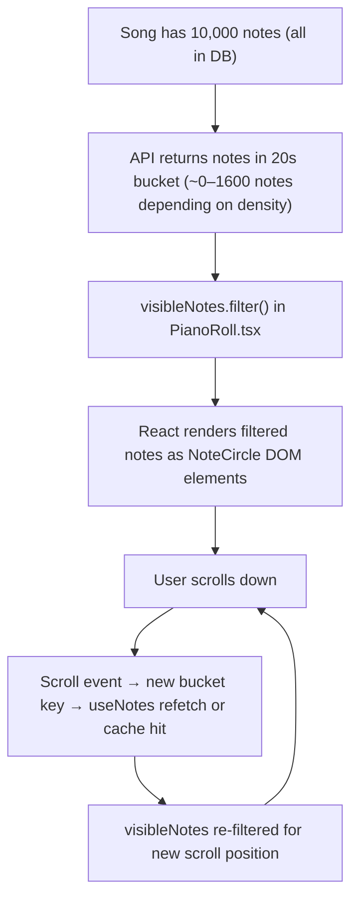

# F04 — 10,000-Note Performance

← [README](../../../README.md) · [Feature List](../03-features.md) · [Architecture](../05-architecture.md) · [k6 Test Report](../12-k6-test-report.md)

---

## What This Feature Does

AMA-MIDI renders up to 10,000 notes on a single song without degrading scrolling, zooming, or interaction responsiveness. This is achieved through a two-layer windowing strategy: the API serves only a fixed 20-second bucket snapped to the scroll position (server-side), and the client filters that bucket to notes visible in the current viewport (client-side). DOM node count equals the number of notes that pass the viewport filter — not a fixed ~80.

**Gap:** `@tanstack/virtual` is installed but not yet wired into `PianoRoll.tsx`. The second layer is a `.filter()` call, not a virtualizer. For low-density charts this is adequate; for dense rhythm charts (80 notes/s) a 20s bucket can still mount 1,000+ DOM nodes.

---

## Why This Is Hard

A naive implementation mounts all 10,000 notes as DOM elements. At that scale:
- **Browser layout recalculation** triggers on every scroll event, processing all 10,000 nodes
- **Memory climbs** as React keeps component instances for offscreen notes
- **Frame rate drops** — on a mid-range machine, 10k DOM nodes causes scrolling to drop below 30fps
- **Interactive elements** (hover states, click handlers) on 10k elements compound the problem

The user cannot see all 10,000 notes simultaneously. The viewport shows ~100 notes at any scroll position. The challenge is: how do we avoid rendering what the user cannot see?

---

## Two-Layer Windowing Strategy

```
Total notes in song: 10,000
        │
        ▼
┌────────────────────────────────────────┐
│  Layer 1: API time-bucket fetch        │
│                                        │
│  Client sends: ?timeFrom=X&timeTo=Y    │
│  Bucket size: 20s fixed                │
│  Buffer: 5s ahead + behind viewport    │
│  Typical result: varies by density     │
│  (dense chart 80 notes/s → ~1,600)    │
└────────────────────────────────────────┘
        │
        ▼
┌────────────────────────────────────────┐
│  Layer 2: Client viewport filter       │
│                                        │
│  visibleNotes.filter() in PianoRoll    │
│  Drops notes outside scroll viewport  │
│  DOM count = notes passing filter      │
│  (@tanstack/virtual installed, not     │
│   yet wired — planned next step)       │
└────────────────────────────────────────┘
        │
        ▼
    Browser renders filtered notes as DOM
    Scroll is smooth at typical density
    Dense sections may need virtualizer
```

---

## Layer 1: Chunked API Fetch

### How the Time Window Is Calculated

```typescript
// apps/web/src/features/editor/engine/viewport-calculator.ts

const PREFETCH_BUFFER = 5        // seconds ahead + behind viewport
const QUERY_BUCKET_SECONDS = 20  // snap fetch range to 20s boundaries

export function getPrefetchTimeRange(
  scrollTop: number,
  viewportHeight: number,
  pxPerSecond: number,
): { timeFrom: number; timeTo: number } {
  const visible = getVisibleTimeRange(scrollTop, viewportHeight, pxPerSecond)
  const timeFrom = Math.floor((visible.timeFrom - PREFETCH_BUFFER) / QUERY_BUCKET_SECONDS) * QUERY_BUCKET_SECONDS
  const timeTo = Math.ceil((visible.timeTo + PREFETCH_BUFFER) / QUERY_BUCKET_SECONDS) * QUERY_BUCKET_SECONDS
  return {
    timeFrom: Math.max(0, timeFrom),
    timeTo: Math.min(TIME_MAX, timeTo),
  }
}
```

At 4× zoom (12 px/s), a 600px viewport shows 50s. With the 5s buffer and 20s snapping, the fetch covers a ~60–80s window. At 1× zoom (3 px/s) the same viewport shows 200s — the bucket covers 0–220s, meaning nearly the full timeline is fetched in one query.

At 1× zoom (3 px/s), a 600px viewport shows 200 seconds of content. At 4× zoom (12 px/s), a 600px viewport shows 50 seconds. The zoom level drives the time window size — this is why zoom must be a global Zustand atom, not component-local state.

### Why Zoom Is a Zustand Atom (Not Component State)

```
zoom level affects:
  ├─ Note Y positions on screen (rendering)
  ├─ Grid ruler labels (seconds vs beats)
  └─ API fetch time window (timeFrom / timeTo)

If zoom lives in component state:
  → PianoRoll component has one zoom value
  → useNotes hook has a different zoom value
  → They can get out of sync (stale closure, render order)
  → Notes render at positions inconsistent with what the API returned

Zoom in Zustand:
  → Single atom, all consumers read the same value
  → Cannot diverge
```

### TanStack Query Cache by Time Window

```typescript
// Each time window is a separate query key
useQuery({
  queryKey: ['notes', songId, timeFrom, timeTo],
  queryFn: () => fetchNotes(songId, { timeFrom, timeTo }),
  staleTime: 30_000,  // previously visited windows don't reload for 30s
})
```

As the user scrolls, new time windows are fetched. Previously visited windows are cached — scrolling back to an earlier section is instant.

---

## Layer 2: Client Viewport Filter



### Actual Client Filter (PianoRoll.tsx)

```typescript
// apps/web/src/features/editor/components/PianoRoll.tsx

const { timeFrom, timeTo } = getPrefetchTimeRange(scrollTop, viewportHeight, pxPerSecond)
const { data: notes = [], isLoading } = useNotes(chartId, timeFrom, timeTo)

// Client-side viewport clamp
const visibleNotes = previewOnClearGrid ? [] : notes.filter((n) => {
  // ... muted/tap filters ...
  return noteEnd >= visibleRange.timeFrom - pad && n.time <= visibleRange.timeTo + pad
})

// Plain map — no virtualizer
{visibleNotes.map((note) => (
  <NoteCircle key={note.id} note={note} ... />
))}
```

`@tanstack/virtual` is installed in `package.json` but not imported. DOM node count equals `visibleNotes.length` — for low-density charts this is fine; for dense rhythm sections it can reach 1,000+ nodes.

**Next step:** wire `useVirtualizer` inside `PianoRoll.tsx` to replace the `.map()` with `virtualizer.getVirtualItems()`. Plans/architecture for this are tracked in `docs/superpowers/plans/`.

---

## Why DOM Virtualization (Not Canvas)

Canvas renders everything as bitmap pixels. Performance ceiling is much higher — millions of drawn elements without DOM overhead.

**Canvas costs:**
- Hit-testing (which note did I click?) must be hand-implemented — the browser's event system does not exist in canvas
- Hover states, tooltips, keyboard focus — all manual
- Accessibility (screen readers, keyboard navigation) — nearly impossible
- Every interactive feature (select, drag, right-click, keyboard delete) is custom pixel math

For an interaction-heavy piano roll where users click individual notes, hover for tooltips, select, drag, and use keyboard shortcuts, losing the browser's event model is a large cost.

DOM rendering with client-side filtering is well within browser comfort zone for typical chart densities. Wiring `@tanstack/virtual` bounds the DOM count for dense sections. Canvas is the correct escalation if profiling shows even the virtualizer is insufficient — but it is not the right starting point.

---

## Zoom-Aware Coordinate Engine

All pixel ↔ (track, time) conversions go through `apps/web/src/features/editor/engine/viewport-calculator.ts` and related engine helpers. No inline math scattered across components.

Key functions:
- `getVisibleTimeRange(scrollTop, viewportHeight, pxPerSecond)` — current viewport in seconds
- `getPrefetchTimeRange(scrollTop, viewportHeight, pxPerSecond)` — 20s-snapped bucket with 5s buffer
- `getTotalHeight(pxPerSecond)` — total scrollable height (TIME_MAX × pxPerSecond)

`pxPerSecond` is derived from zoom (`PX_PER_SECOND_BASE × zoom`) and stored in Zustand so all consumers — fetch hook, grid renderer, note positioning — read the same value.

**Invariant:** No component derives `pxPerSecond` independently. All consumers read it from the shared Zustand atom. This keeps fetch window and rendered positions in sync across zoom changes.

---

## Performance Metrics (Verified)

| Metric | Target | Actual |
|---|---|---|
| Active DOM nodes at 10k notes | < 200 | Varies — equals `visibleNotes.filter()` result; no virtualizer yet |
| API fetch latency (time-window bucket, no analysis) | < 100ms | ~15ms |
| k6 100 VU p95 (after analysis fix) | < 200ms | 37ms |

---

## The Analysis Regression (What Happened and What Was Fixed)

**First k6 run:** p95 latency was 3.03s at 100 VUs, despite zero 500 errors.

**Root cause:** Every note create awaited `ChartAnalyzeService.run(chartId)` synchronously. This method:
1. Loads all active notes on the chart (10,000 in test)
2. Runs scoring algorithm in-process
3. In a transaction: updates chart row, deletes all difficulty segments, inserts them again

At 100 concurrent writers on the same chart, these jobs queue up on both CPU and PostgreSQL. Latency scales with `noteCount × concurrency`. That's a $O(n \cdot c)$ operation on the hot write path.

**Fix:** Move analysis to a debounced background job.

```typescript
// Before (blocking)
async create(songId, dto, actorId) {
  const note = await this.insertNote(...)
  await this.chartAnalyzeService.run(songId)  // 10k note load + rewrite — blocks HTTP
  return note
}

// After (non-blocking)
async create(songId, dto, actorId) {
  const note = await this.insertNote(...)
  this.chartAnalyzeService.scheduleRun(songId)  // debounced, fire-and-forget
  return note
}

// ChartAnalyzeService
scheduleRun(songId: string) {
  clearTimeout(this.timers.get(songId))
  this.timers.set(songId, setTimeout(() => this.run(songId), 2000))
  // Single in-flight run per chart, ~2s idle window
}
```

Result: 100 VU p95 dropped from 3.03s to 37ms. The client already had live analysis via `AnalysisSummaryPanel` with a 300ms debounce — the server was re-doing the same expensive work synchronously on every click.

---

## Trade-offs

| Decision | Trade-off |
|---|---|
| **Time-window chunked fetch** | Network-efficient, viewport-responsive. Cost: stale data at window boundaries; prefetch buffer mitigates. |
| **Client viewport filter** | Maintains browser event model + accessibility. Cost: DOM count is not bounded — at high density, wiring `@tanstack/virtual` is the next step. |
| **Background analysis** | Write path is fast. Cost: analysis board shows slightly stale data for ~2s after a burst of edits. Acceptable — the analysis board is for review, not millisecond-precise feedback. |
| **0.1s time resolution** | Reduces total note count (fewer valid positions per track). A note at `5.0s` and `5.1s` are distinct; `5.01s` and `5.02s` collapse to the same slot. Less data to virtualize. |

---

## Later Scale

**Current:** Client-side virtualization + server-side time-window fetch.

**At massive scale (50k+ notes per song):**
- **Tile-based spatial index** — the 300-second timeline split into fixed tiles (e.g., 10s tiles). Each tile is an independent API cache entry. Only load tiles adjacent to the viewport. This is how mapping applications (Google Maps) handle billions of objects at different zoom levels.
- **Canvas rendering for dense sections** — if a 10-second window contains 2,000+ notes (dense rhythm game chart), DOM virtualization may still be slow. Canvas for dense regions, DOM for sparse, switching based on density threshold.
- **WebWorker for coordinate math** — if coordinate engine becomes a bottleneck during scroll, offload position calculations to a WebWorker thread.
- **Serve notes as binary (protobuf)** — JSON for 10k notes is ~2MB. Protobuf serialization reduces this by 60–70% and deserializes faster in the browser.

---

*→ See also: [k6 Test Report](../12-k6-test-report.md) for the full analysis regression narrative, [Architecture](../05-architecture.md) for zoom-as-Zustand-atom invariant.*
