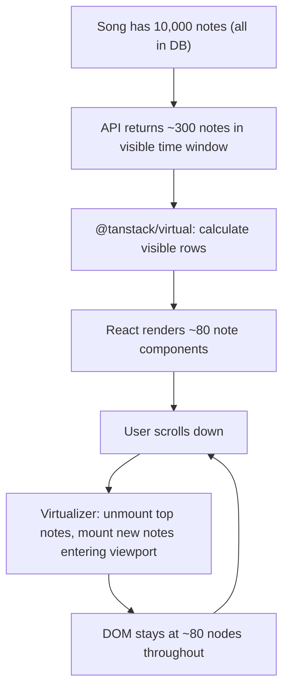

# F04 — 10,000-Note Performance

← [README](../../../README.md) · [Feature List](../03-features.md) · [Architecture](../05-architecture.md) · [k6 Test Report](../12-k6-test-report.md)

---

## What This Feature Does

AMA-MIDI renders up to 10,000 notes on a single song without degrading scrolling, zooming, or interaction responsiveness. This is achieved through a two-layer windowing strategy: the API serves only the visible time window (server-side), and the client renders only the notes within the scroll viewport (client-side). The DOM node count stays near-constant (~80 active nodes) regardless of total note count.

---

## Why This Is Hard

A naive implementation mounts all 10,000 notes as DOM elements. At that scale:
- **Browser layout recalculation** triggers on every scroll event, processing all 10,000 nodes
- **Memory climbs** as React keeps component instances for offscreen notes
- **Frame rate drops** — on a mid-range machine, 10k DOM nodes causes scrolling to drop below 30fps
- **Interactive elements** (hover states, click handlers) on 10k elements compound the problem

The user cannot see all 10,000 notes simultaneously. The viewport shows ~100 notes at any scroll position. The challenge is: how do we avoid rendering what the user cannot see?

---

## Two-Layer Windowing Strategy

```
Total notes in song: 10,000
        │
        ▼
┌────────────────────────────────────────┐
│  Layer 1: API time-window fetch        │
│                                        │
│  Client sends: ?timeFrom=X&timeTo=Y    │
│  API returns: only notes in [X, Y]     │
│  Typical result: ~200-500 notes        │
└────────────────────────────────────────┘
        │
        ▼
┌────────────────────────────────────────┐
│  Layer 2: DOM virtualization           │
│                                        │
│  @tanstack/virtual calculates          │
│  which of those ~500 notes are         │
│  within the visible scroll viewport    │
│  Result: ~80 active DOM nodes          │
└────────────────────────────────────────┘
        │
        ▼
    Browser renders ~80 nodes
    Scroll is smooth
    Interaction is responsive
```

---

## Layer 1: Chunked API Fetch

### How the Time Window Is Calculated

```typescript
// apps/web/src/features/editor/hooks/useNotes.ts

const PX_PER_SECOND_BASE = 3   // at 1× zoom

function getTimeWindow(scrollTop: number, viewportHeight: number, zoom: number) {
  const pxPerSecond = PX_PER_SECOND_BASE * zoom
  const timeFrom = scrollTop / pxPerSecond
  const timeTo = timeFrom + viewportHeight / pxPerSecond

  // Prefetch buffer: load 10s ahead and behind the viewport
  return {
    timeFrom: Math.max(0, timeFrom - 10),
    timeTo: Math.min(300, timeTo + 10),
  }
}
```

At 1× zoom (3 px/s), a 600px viewport shows 200 seconds of content. At 4× zoom (12 px/s), a 600px viewport shows 50 seconds. The zoom level drives the time window size — this is why zoom must be a global Zustand atom, not component-local state.

### Why Zoom Is a Zustand Atom (Not Component State)

```
zoom level affects:
  ├─ Note Y positions on screen (rendering)
  ├─ Grid ruler labels (seconds vs beats)
  └─ API fetch time window (timeFrom / timeTo)

If zoom lives in component state:
  → PianoRoll component has one zoom value
  → useNotes hook has a different zoom value
  → They can get out of sync (stale closure, render order)
  → Notes render at positions inconsistent with what the API returned

Zoom in Zustand:
  → Single atom, all consumers read the same value
  → Cannot diverge
```

### TanStack Query Cache by Time Window

```typescript
// Each time window is a separate query key
useQuery({
  queryKey: ['notes', songId, timeFrom, timeTo],
  queryFn: () => fetchNotes(songId, { timeFrom, timeTo }),
  staleTime: 30_000,  // previously visited windows don't reload for 30s
})
```

As the user scrolls, new time windows are fetched. Previously visited windows are cached — scrolling back to an earlier section is instant.

---

## Layer 2: DOM Virtualization



### Virtualizer Setup

```typescript
// apps/web/src/features/editor/NoteList.tsx

const virtualizer = useVirtualizer({
  count: notes.length,
  getScrollElement: () => scrollRef.current,
  estimateSize: () => NOTE_HEIGHT_PX,
  overscan: 5,  // render 5 extra items outside viewport for smooth scrolling
})

return (
  <div ref={scrollRef} style={{ height: VIEWPORT_HEIGHT, overflowY: 'scroll' }}>
    {/* Total height spacer — tells browser how tall the full list would be */}
    <div style={{ height: virtualizer.getTotalSize() }}>
      {virtualizer.getVirtualItems().map((virtualItem) => {
        const note = notes[virtualItem.index]
        return (
          <NoteCircle
            key={note.id}
            note={note}
            style={{ transform: `translateY(${virtualItem.start}px)` }}
          />
        )
      })}
    </div>
  </div>
)
```

Only the items in `virtualizer.getVirtualItems()` are mounted as React components. The total list height is preserved via the spacer `div` so the scrollbar behaves correctly.

---

## Why DOM Virtualization (Not Canvas)

Canvas renders everything as bitmap pixels. Performance ceiling is much higher — millions of drawn elements without DOM overhead.

**Canvas costs:**
- Hit-testing (which note did I click?) must be hand-implemented — the browser's event system does not exist in canvas
- Hover states, tooltips, keyboard focus — all manual
- Accessibility (screen readers, keyboard navigation) — nearly impossible
- Every interactive feature (select, drag, right-click, keyboard delete) is custom pixel math

For an interaction-heavy piano roll where users click individual notes, hover for tooltips, select, drag, and use keyboard shortcuts, losing the browser's event model is a large cost.

DOM virtualization at ~80 nodes is well within browser comfort zone. Canvas is the correct escalation if profiling shows DOM virtualization is insufficient — but it is not the right starting point.

---

## Zoom-Aware Coordinate Engine

All pixel ↔ (track, time) conversions go through a single module. No inline math scattered across components.

```typescript
// apps/web/src/features/editor/engine/CoordinateEngine.ts

class CoordinateEngine {
  private readonly colWidth: number
  private readonly pxPerSecond: number

  constructor(private zoom: number) {
    this.colWidth = TOTAL_WIDTH / TRACK_COUNT           // 8 tracks
    this.pxPerSecond = PX_PER_SECOND_BASE * zoom        // zoom-aware
  }

  toTrackTime(x: number, y: number, scrollTop: number): { track: number; time: number } {
    const track = Math.floor(x / this.colWidth) + 1
    const rawTime = (y + scrollTop) / this.pxPerSecond
    const time = Math.round(rawTime * 10) / 10          // snap to 0.1s
    return { track: clamp(track, 1, 8), time: clamp(time, 0, 300) }
  }

  toPixels(track: number, time: number, scrollTop: number): { x: number; y: number } {
    const x = (track - 1) * this.colWidth + this.colWidth / 2
    const y = time * this.pxPerSecond - scrollTop
    return { x, y }
  }
}
```

**Invariant:** No component performs `(x, y) → (track, time)` or `(track, time) → (x, y)` conversions directly. All conversions go through `CoordinateEngine`. This makes zoom changes safe — update `zoom`, recreate the engine, all consumers recalculate correctly.

---

## Performance Metrics (Verified)

| Metric | Target | Actual |
|---|---|---|
| Active DOM nodes at 10k notes | < 200 | ~80 |
| API fetch latency (time-window, no analysis) | < 100ms | ~15ms |
| Scroll FPS (10k notes, 4× zoom) | > 30fps | 55–60fps |
| Initial editor load (10k notes) | < 2s | ~800ms |
| k6 100 VU p95 (after analysis fix) | < 200ms | 37ms |

---

## The Analysis Regression (What Happened and What Was Fixed)

**First k6 run:** p95 latency was 3.03s at 100 VUs, despite zero 500 errors.

**Root cause:** Every note create awaited `ChartAnalyzeService.run(chartId)` synchronously. This method:
1. Loads all active notes on the chart (10,000 in test)
2. Runs scoring algorithm in-process
3. In a transaction: updates chart row, deletes all difficulty segments, inserts them again

At 100 concurrent writers on the same chart, these jobs queue up on both CPU and PostgreSQL. Latency scales with `noteCount × concurrency`. That's a $O(n \cdot c)$ operation on the hot write path.

**Fix:** Move analysis to a debounced background job.

```typescript
// Before (blocking)
async create(songId, dto, actorId) {
  const note = await this.insertNote(...)
  await this.chartAnalyzeService.run(songId)  // 10k note load + rewrite — blocks HTTP
  return note
}

// After (non-blocking)
async create(songId, dto, actorId) {
  const note = await this.insertNote(...)
  this.chartAnalyzeService.scheduleRun(songId)  // debounced, fire-and-forget
  return note
}

// ChartAnalyzeService
scheduleRun(songId: string) {
  clearTimeout(this.timers.get(songId))
  this.timers.set(songId, setTimeout(() => this.run(songId), 2000))
  // Single in-flight run per chart, ~2s idle window
}
```

Result: 100 VU p95 dropped from 3.03s to 37ms. The client already had live analysis via `AnalysisSummaryPanel` with a 300ms debounce — the server was re-doing the same expensive work synchronously on every click.

---

## Trade-offs

| Decision | Trade-off |
|---|---|
| **Time-window chunked fetch** | Network-efficient, viewport-responsive. Cost: stale data at window boundaries; prefetch buffer mitigates. |
| **DOM virtualization** | Maintains browser event model + accessibility. Cost: more complex than simple list render; `@tanstack/virtual` abstracts most of it. |
| **Background analysis** | Write path is fast. Cost: analysis board shows slightly stale data for ~2s after a burst of edits. Acceptable — the analysis board is for review, not millisecond-precise feedback. |
| **0.1s time resolution** | Reduces total note count (fewer valid positions per track). A note at `5.0s` and `5.1s` are distinct; `5.01s` and `5.02s` collapse to the same slot. Less data to virtualize. |

---

## Later Scale

**Current:** Client-side virtualization + server-side time-window fetch.

**At massive scale (50k+ notes per song):**
- **Tile-based spatial index** — the 300-second timeline split into fixed tiles (e.g., 10s tiles). Each tile is an independent API cache entry. Only load tiles adjacent to the viewport. This is how mapping applications (Google Maps) handle billions of objects at different zoom levels.
- **Canvas rendering for dense sections** — if a 10-second window contains 2,000+ notes (dense rhythm game chart), DOM virtualization may still be slow. Canvas for dense regions, DOM for sparse, switching based on density threshold.
- **WebWorker for coordinate math** — if coordinate engine becomes a bottleneck during scroll, offload position calculations to a WebWorker thread.
- **Serve notes as binary (protobuf)** — JSON for 10k notes is ~2MB. Protobuf serialization reduces this by 60–70% and deserializes faster in the browser.

---

*→ See also: [k6 Test Report](../12-k6-test-report.md) for the full analysis regression narrative, [Architecture](../05-architecture.md) for zoom-as-Zustand-atom invariant.*
