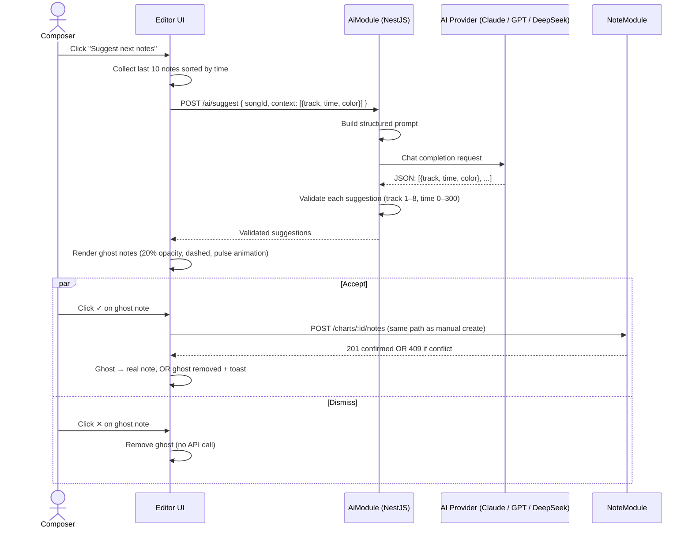

# F05 — AI Note Suggester

← [README](../../../README.md) · [Feature List](../03-features.md) · [Workflows](../06-workflows.md)

---

## What This Feature Does

After a composer places at least 5 notes, a "Suggest next notes" button appears in the editor toolbar. Clicking it sends the last 10 notes (track, time, color) to an AI provider and receives 3–5 suggested continuation notes. These appear as **ghost overlays** on the piano roll — translucent, pulsing, clearly not real notes. The composer can accept each suggestion (it becomes a real note via the normal write pipeline) or dismiss it (removed from UI, no server interaction).

---

## Product Intent: Autocomplete, Not Generation

The AI suggester is not generating music from scratch. That would be the wrong product.

A composer who has placed 5 notes has established a pattern — a rhythmic structure, preferred tracks, a tempo feel. The AI's job is to **recognize that pattern and propose what logically comes next**. This is intelligent autocomplete, the same mental model as GitHub Copilot suggesting the next line of code.

This framing matters because it defines what "good" looks like. A good suggestion continues the pattern coherently. A bad suggestion ignores context and places random notes. The prompt is designed around this distinction.

---

## Multi-Provider Architecture

AMA-MIDI supports three AI backends behind the same interface. The provider is selected at deploy time via `AI_PROVIDER` environment variable.

```
┌─────────────────────────────────────────────────────┐
│  AiModule (NestJS)                                   │
│                                                      │
│  AiService                                           │
│   └─ abstract interface: suggest(context) → notes    │
│                                                      │
│  Implementations:                                    │
│   ├─ AnthropicProvider  (claude-sonnet-4-x)          │
│   ├─ OpenAiProvider     (gpt-4o)                     │
│   └─ DeepSeekProvider   (deepseek-chat, low-cost)    │
│                                                      │
│  Selection: process.env.AI_PROVIDER                  │
└─────────────────────────────────────────────────────┘
```

**Why swappable providers?**
- Production quality: Anthropic Claude or OpenAI GPT-4o
- Development / low-cost: DeepSeek
- Evaluation: switch without touching any business logic

Same prompt contract, same output schema, different underlying model. The rest of the system doesn't know or care which provider is active.

---

## How It Works

### Full Flow



### Prompt Design

```
SYSTEM:
You are a MIDI note pattern assistant. Analyze the given note sequence
and suggest 4–5 notes that naturally continue the rhythmic pattern.
Return ONLY valid JSON. No explanation.

USER:
Here are the last 10 notes placed in this song:
[
  { "track": 2, "time": 1.0, "color": "#3B82F6" },
  { "track": 4, "time": 1.5, "color": "#10B981" },
  { "track": 2, "time": 2.0, "color": "#3B82F6" },
  ...
]

Return 4–5 suggested next notes as JSON array:
[{ "track": <1-8>, "time": <0.0-300.0>, "color": "<hex>" }]

Rules:
- Continue the pattern and rhythm, do not restart it
- time values must be greater than 2.0 (last note time)
- Use colors that match the track patterns you observe
- Return only the JSON array, no other text
```

**Why include color in context?**

Color carries semantic meaning in AMA-MIDI. If the composer consistently uses blue (`#3B82F6`) for Track 2, the AI should continue suggesting blue for Track 2. The color hints help the AI understand the composer's layer organization. Suggestions that respect the color pattern feel coherent; suggestions that ignore it feel random.

### Response Validation

```typescript
// apps/api/src/modules/ai/ai.service.ts

async suggest(songId: string, context: NoteContext[]): Promise<NoteSuggestion[]> {
  const raw = await this.provider.complete(buildPrompt(context))
  const parsed = JSON.parse(raw)

  return parsed
    .filter((s) => (
      Number.isInteger(s.track) && s.track >= 1 && s.track <= 8 &&
      typeof s.time === 'number' && s.time >= 0 && s.time <= 300 &&
      typeof s.color === 'string' && s.color.startsWith('#')
    ))
    .slice(0, 5)  // cap at 5 regardless of model output
}
```

Invalid suggestions are silently filtered. If the model returns 0 valid suggestions (hallucination or format error), the API returns an empty array and the UI shows "No suggestions available." No crash, no 500.

---

## Ghost Note UI

Ghost notes are visually distinct from real notes at every level:

```css
/* Ghost note styles */
.note-ghost {
  opacity: 0.2;
  border: 2px dashed currentColor;
  animation: ghost-pulse 1.5s ease-in-out infinite;
  pointer-events: auto;  /* still clickable for accept/dismiss */
}

@keyframes ghost-pulse {
  0%, 100% { transform: scale(1.0); }
  50%       { transform: scale(1.05); }
}
```

The pulse animation communicates: *this is provisional, not confirmed*. The dashed border communicates: *this is a suggestion boundary, not a completed action*.

Accept (✓) and dismiss (✕) controls appear on hover. They are small and unobtrusive — the composer can ignore all ghost notes and keep placing real notes without the UI demanding attention.

---

## Invariant: AI Does Not Bypass the Integrity Layer

When a composer accepts a suggestion, it goes through the exact same path as a manually placed note:

```
Accept ghost → POST /charts/:id/notes → DB unique check → 201 or 409
```

If another composer has taken that position since the suggestion was generated, the same 409 conflict path triggers. The ghost disappears, a toast appears. The AI integration sits on top of the integrity layer; it does not bypass it.

This is non-obvious but critical. A different design might "fast path" AI-accepted notes to avoid the duplicate check — that would silently create corrupted data.

---

## Implementation Reference

### NestJS AiModule (Provider Selection)

```typescript
// apps/api/src/modules/ai/ai.module.ts

@Module({
  providers: [
    {
      provide: AI_PROVIDER,
      useFactory: () => {
        switch (process.env.AI_PROVIDER) {
          case 'openai':    return new OpenAiProvider(process.env.OPENAI_API_KEY)
          case 'deepseek':  return new DeepSeekProvider(process.env.DEEPSEEK_API_KEY)
          default:          return new AnthropicProvider(process.env.ANTHROPIC_API_KEY)
        }
      },
    },
    AiService,
  ],
  controllers: [AiController],
})
export class AiModule {}
```

### Frontend Ghost State

```typescript
// apps/web/src/features/editor/hooks/useAiSuggestions.ts

const { mutate: fetchSuggestions, isPending } = useMutation({
  mutationFn: () => api.post('/ai/suggest', { songId, context: last10Notes }),
  onSuccess: (data) => {
    setSuggestions(data)  // Zustand: renders as ghost overlays
  },
})

const acceptSuggestion = (suggestion: NoteSuggestion) => {
  // Goes through normal note creation flow — no shortcut
  createNote({ songId, track: suggestion.track, time: suggestion.time, color: suggestion.color })
    .then(() => removeSuggestion(suggestion))
    .catch((err) => {
      removeSuggestion(suggestion)
      if (err.status === 409) toast.warning('Position taken — collaborator was faster')
    })
}
```

---

## Trade-offs

| Decision | Trade-off |
|---|---|
| **Multi-provider via env var** | Flexibility without code changes. Cost: different models produce different suggestion quality; no A/B infrastructure currently. |
| **Last 10 notes as context** | Simple, stateless context window. Cost: loses global structure awareness (what happened 200 notes ago). Phase 6 adds "global chart context" (sections, density segments) for richer AI input. |
| **Ghost overlay (not inline suggestion)** | Visually clear that suggestions are provisional. Cost: composer must interact with each ghost individually — no "accept all" shortcut in current version. |
| **Silent filtering of invalid suggestions** | Graceful degradation. Cost: if the model consistently produces invalid output, the feature silently fails instead of surfacing the issue. Logged at the API level for debugging. |
| **AI note ≡ human note after accept** | Clean data model — no "AI source" flag needed. Cost: no analytics on AI acceptance rate or suggestion quality without additional instrumentation. |

---

## Later Scale

**Current:** Synchronous API call per request — the client POSTs, waits, gets suggestions.

**At higher usage:**
- **Server-Sent Events (SSE) for streaming** — instead of waiting for all 5 suggestions, stream them one-by-one as the model generates. First suggestion appears in ~500ms; remaining suggestions arrive progressively. Phase 6 spec already calls for SSE on the AI Assistant modal.
- **Suggestion cache by song + recent notes hash** — if the same composer clicks "suggest" twice in quick succession without placing new notes, return the cached result instead of re-calling the model. TTL: 30 seconds.
- **Background suggestion pre-computation** — after every 3 notes placed, pre-fetch suggestions in the background (don't show yet). When the composer clicks the button, suggestions are already ready — zero wait.
- **Model fine-tuning on accepted patterns** — log which suggestions were accepted (by track, time interval, color match) and use this data to fine-tune a smaller model for rhythm-game specific patterns. This is the long-term path to suggestions that feel like they understand the specific game genre.

---

*→ See also: [Note CRUD & Duplicate Prevention](./F01-note-crud-duplicate-prevention.md) for the write pipeline that AI-accepted notes go through, [Realtime Architecture](../Realtime.md) for how accepted AI notes broadcast to collaborators.*
