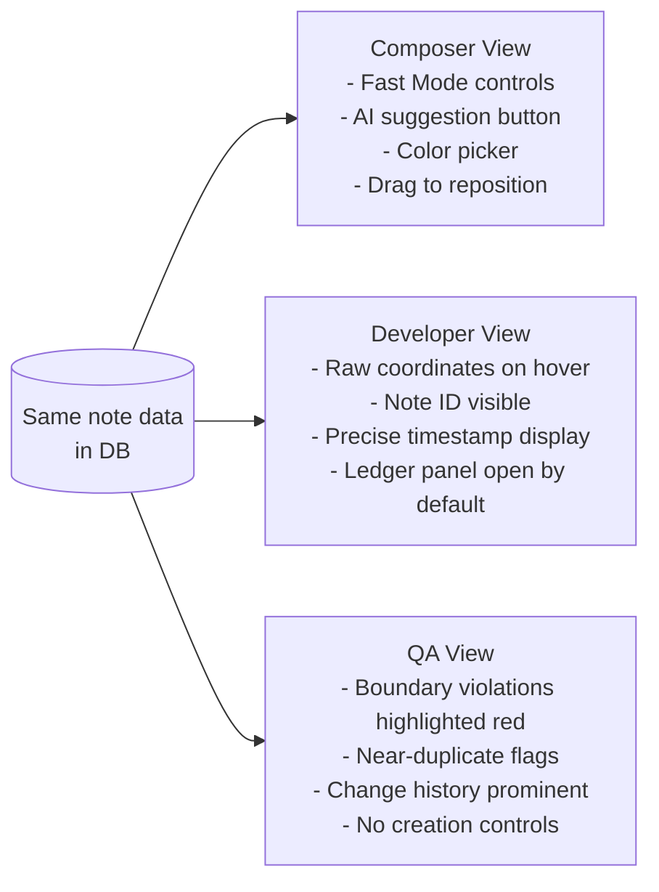

# F06 — Role-Based Access Control

← [README](../../../README.md) · [Feature List](../03-features.md) · [Actors & Use Cases](../02-actors-and-use-cases.md)

---

## What This Feature Does

AMA-MIDI enforces role-based access at two layers simultaneously: the API rejects unauthorized requests at the route guard level, and the UI hides mutation controls for read-only users. A user with Viewer role cannot create, edit, or delete notes — not because the UI doesn't show the button, but because the API rejects the request even if somehow the button is invoked.

---

## Why Two-Layer Enforcement

**UI-only enforcement** is insufficient for any system that handles real data. A determined user can call API endpoints directly (curl, DevTools, Postman). If the API doesn't enforce roles, UI restrictions are theater.

**API-only enforcement** is technically correct but creates a bad user experience. A Viewer opening the editor should not see edit controls that produce confusing errors when clicked. The UI layer hides controls that the user doesn't have permission to use — making the interface appropriate for their role, not just safe.

The two layers serve different purposes:
- **API layer** — security and data integrity
- **UI layer** — user experience and role-appropriate interface

---

## The Four Roles

| Role | Who | Can create/edit notes | Can manage songs | Can manage users |
|---|---|:---:|:---:|:---:|
| **Admin** | System administrator | ✅ | ✅ | ✅ |
| **Composer** | Sound designer, level author | ✅ | Own songs only | ❌ |
| **Developer** | Game developer, integrator | ❌ | ❌ | ❌ |
| **Viewer** | Product owner, QA reviewer | ❌ | ❌ | ❌ |

### Full Permission Matrix

| Action | Admin | Composer | Developer | Viewer |
|---|:---:|:---:|:---:|:---:|
| Create song | ✅ | ✅ | ❌ | ❌ |
| Edit song metadata | ✅ | ✅ | ❌ | ❌ |
| Archive song | ✅ | Owner only | ❌ | ❌ |
| View song + editor | ✅ | ✅ | ✅ | ✅ |
| Create note | ✅ | ✅ | ❌ | ❌ |
| Edit note | ✅ | ✅ | ❌ | ❌ |
| Delete note | ✅ | ✅ | ❌ | ❌ |
| View change history | ✅ | ✅ | ✅ | ✅ |
| Accept AI suggestions | ✅ | ✅ | ❌ | ❌ |
| Manage users | ✅ | ❌ | ❌ | ❌ |

---

## How It Works

### Authentication Flow

```mermaid
sequenceDiagram
    actor User
    participant Browser
    participant Google as Google OAuth
    participant API as NestJS AuthModule
    participant PG as PostgreSQL

    User->>Browser: Click "Sign in with Google"
    Browser->>Google: OAuth redirect
    Google->>Browser: Authorization code
    Browser->>API: GET /auth/google/callback?code=...
    API->>Google: Exchange code for user info
    Google-->>API: { email, name, avatar }
    API->>PG: UPSERT user, fetch assigned role
    PG-->>API: { id, email, role: 'COMPOSER' }
    API->>API: Sign JWT { sub: userId, role: 'COMPOSER', exp: ... }
    API-->>Browser: Set-Cookie: token=<JWT>; HttpOnly; SameSite=Strict
    Browser->>Browser: Redirect to dashboard
```

**Why Google OAuth (not username/password)?**

In an enterprise context, team identity is managed centrally. When someone leaves Amanotes, their Google account is disabled — their AMA-MIDI access is revoked automatically, with no manual cleanup required. Password management is a security liability (password reuse, weak passwords, forgotten credentials). SSO eliminates that liability entirely.

The dependency risk: if Google Workspace goes down, users cannot log in. Acceptable trade-off for an internal tool serving an enterprise that already depends on Google Workspace.

### API Guard (NestJS)

```mermaid
flowchart LR
    Request --> JwtAuthGuard
    JwtAuthGuard -->|valid JWT| RolesGuard
    JwtAuthGuard -->|invalid/missing| 401 Unauthorized
    RolesGuard -->|role permitted| Controller Handler
    RolesGuard -->|role not permitted| 403 Forbidden
    Controller Handler --> Business Logic
```

```typescript
// apps/api/src/common/guards/roles.guard.ts

@Injectable()
export class RolesGuard implements CanActivate {
  constructor(private reflector: Reflector) {}

  canActivate(context: ExecutionContext): boolean {
    const requiredRoles = this.reflector.getAllAndOverride<Role[]>(ROLES_KEY, [
      context.getHandler(),
      context.getClass(),
    ])

    if (!requiredRoles) return true  // undecorated = public

    const { user } = context.switchToHttp().getRequest()
    return requiredRoles.some((role) => user.role === role)
  }
}
```

```typescript
// Usage on controller
@Post(':chartId/notes')
@Roles(Role.ADMIN, Role.COMPOSER)    // Only these roles reach this handler
@UseGuards(JwtAuthGuard, RolesGuard)
async createNote(@Param('chartId') chartId: string, @Body() dto: CreateNoteDto, @Req() req) {
  return this.notesService.create(chartId, dto, req.user.id)
}

@Get(':chartId/notes')
@Roles(Role.ADMIN, Role.COMPOSER, Role.DEVELOPER, Role.VIEWER)  // All authenticated
@UseGuards(JwtAuthGuard, RolesGuard)
async getNotes(@Param('chartId') chartId: string) {
  return this.notesService.findAll(chartId)
}
```

### UI Enforcement Hook

```typescript
// apps/web/src/hooks/useCanEdit.ts

export function useCanEdit(): boolean {
  const { user } = useAuth()
  return user?.role === 'ADMIN' || user?.role === 'COMPOSER'
}
```

```typescript
// apps/web/src/features/editor/PianoRoll.tsx

const canEdit = useCanEdit()

const handleGridClick = useCallback((e: MouseEvent) => {
  if (!canEdit) return   // Grid clicks are no-ops for Viewers / Developers
  // ... note creation flow
}, [canEdit])
```

```tsx
// Mutation controls hidden for read-only users
{canEdit && (
  <button onClick={handleDelete}>Delete Note</button>
)}
```

### View Mode (Role-Based Lens)

Beyond permission enforcement, each role gets a different *lens* on the same data:



---

## Rate Limiting (Protecting Data Integrity)

Rate limiting at the note creation endpoint is not primarily about preventing abuse. It's about preventing accidental abuse:

- A scripting error that sends 1000 `POST /notes` in a loop
- A runaway frontend bug that spams creates on every render
- An automated process that a developer accidentally pointed at production

**Limit:** 30 note creates per minute per user (JWT sub). No human composer working at normal speed will hit this — Fast Mode at full speed is ~2 notes per second = 120/min, but the limit caps the burst window, not sustained pace.

```typescript
// apps/api/src/modules/notes/notes.controller.ts

@Post(':chartId/notes')
@Throttle({ default: { limit: 30, ttl: 60000 } })  // 30 per minute per user
@UseGuards(JwtAuthGuard, RolesGuard)
@Roles(Role.ADMIN, Role.COMPOSER)
async createNote(...) { ... }
```

### CSRF & Security Headers

```typescript
// apps/api/src/main.ts

app.use(helmet())        // X-Frame-Options, CSP, HSTS, etc.
app.enableCors({
  origin: process.env.FRONTEND_URL,   // locked to known frontend origin
  credentials: true,
})
// CSRF protection: SameSite=Strict cookie + Origin header validation
// The cookie is HttpOnly — XSS cannot steal it
```

`FRONTEND_URL` locks CORS to the known frontend. A third-party site cannot make authenticated API calls in a user's session via CORS. Combined with `SameSite=Strict` cookies, CSRF-adjacent attacks are blocked without a CSRF token.

---

## Trade-offs

| Decision | Trade-off |
|---|---|
| **Google OAuth** | No password management liability; IT-controlled access. Cost: Google Workspace dependency. |
| **JWT in HttpOnly cookie** | XSS cannot steal the token (JS cannot access HttpOnly cookies). Cost: requires CSRF mitigation (handled via SameSite=Strict). |
| **Role stored in JWT** | No DB lookup on every request — the role is in the token. Cost: role changes take effect only on next token refresh (JWT expiry). Admin role-change is not instant without token revocation. |
| **UI hides controls (not just disables)** | Cleaner experience — read-only users see an appropriate interface, not a greyed-out one. Cost: need to maintain visibility state in sync with API permissions. |
| **30-req/min rate limit** | Protects data from scripting errors. Cost: can frustrate developers testing automation. Configurable via env for dev environments. |

---

## Later Scale

**Current:** Role stored in JWT, enforced by NestJS guard per request.

**At larger team size (50+ users, multiple organizations):**
- **Organization-scoped roles** — instead of a global `COMPOSER` role, a user might be `COMPOSER` in Project A and `VIEWER` in Project B. Requires per-project role assignment and a lookup on the authorization path (cannot store in JWT without making it very large).
- **Permission cache** — if per-project roles require DB lookups per request, cache role assertions in Redis (key: `perm:{userId}:{projectId}`, TTL: 60s). Reduces DB load while keeping permission changes propagating quickly.
- **Role change propagation** — current design: role change takes effect on next JWT refresh. At scale, force token revocation (store a `tokenVersion` in DB; JWT carries the version; guard checks version on critical operations).
- **Audit logging** — "who changed whose role when" becomes important in enterprise contexts. Add an `admin_events` table alongside `note_events`. Same event sourcing pattern.

---

*→ See also: [Actors & Use Cases](../02-actors-and-use-cases.md) for the product rationale behind each role, [Architecture](../05-architecture.md) for the NestJS module structure.*
