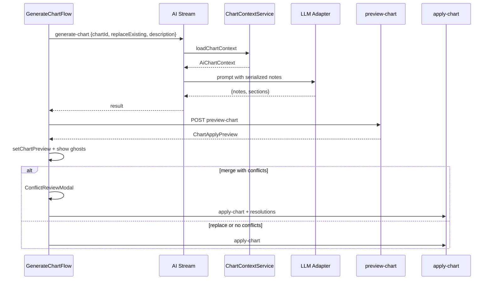

# AI Chart Context & Merge Conflict Review — Design Spec

**Date:** 2026-05-24  
**Status:** Approved  
**Scope:** Backend chart-context builder, prompt serialization, generate-chart awareness, merge-mode conflict review (paste-style)  
**Related:** `2026-05-24-ai-assistant-modal-design.md`, `2026-05-23-paste-conflict-ui-design.md`

---

## Goal

Give every AI chart action a **shared, structured understanding** of the current song and chart — notes as `{ track, time, noteType, duration, title }`, plus sections, density segments, and warnings — so the model can complement an existing chart instead of blindly overwriting slots.

When merge mode still produces collisions, let the user **resolve conflicts explicitly** (same UX as pattern paste) instead of silently skipping notes on apply.

---

## Problem

| Feature | Chart context today | Result |
|---|---|---|
| **Generate chart** | Song metadata + user brief only | Preview ghosts overlap existing solid notes |
| **Scale chart** | Full notes JSON (ad-hoc, capped at 150) | Works, but not shared with other features |
| **Suggest / Fill / Improve** | Global sections/segments + `occupied` as `{track,time}`; window notes lack type/duration | Model cannot see holds/swipes or lane patterns |

**Apply chart (merge mode)** skips conflicting incoming notes with no user choice (`skippedCount` only). Users see overlapping preview ghosts and lose notes silently on accept.

---

## Product Decisions

1. **Rich context + user intent (Option B)** — Generate always receives full structured chart context when `chartId` is provided. The **Replace existing** checkbox switches prompt intent (full replacement vs complement), not whether context is loaded.
2. **Canonical note serialization** — One `AiChartNote` shape matches `GeneratedChartNote` output so the model reads and writes the same schema.
3. **Paste-style conflict review on merge** — When `replaceExisting === false` and preview has conflicts, user resolves per slot (Keep existing / Replace with AI note) before apply. Replace mode skips conflict UI (atomic wipe + apply, same as Scale today).
4. **Server is source of truth** — Conflict detection, preview classification, and apply run on the server inside a transaction. Client shows ghosts for visualization; apply revalidates.
5. **Reuse existing UI** — `ConflictReviewModal` + `PlacementPreview` adapters (same as pattern paste and note copy). `incomingLabel="AI Chart"`.

---

## Shared Types (`packages/shared`)

### AiChartNote

Same fields the model emits in chart JSON:

```typescript
export interface AiChartNote {
  track: number                    // 1–8
  time: number                     // seconds, 0–300, snapped
  noteType: 'TAP' | 'HOLD' | 'SWIPE'
  duration?: number                // required when noteType === 'HOLD'
  title?: string
}
```

### AiChartSection

```typescript
export interface AiChartSection {
  time: number
  label: string
  color?: string
}
```

### AiChartContext

Built once per AI run from DB:

```typescript
export interface AiChartContext {
  song: {
    name: string
    bpm: number
    timeSignature: string
    category: string
  }
  chart: {
    id: string
    name: string
    noteCount: number
    computedDifficulty: string
    speedMultiplier: number
    averageDifficultyScore: number
    peakDifficultyScore: number
  }
  notes: AiChartNote[]             // chronological: time asc, track asc
  sections: AiChartSection[]
  segments: Array<{
    start: number                  // seconds
    end: number
    nps: number
    level: string
    score: number
  }>
  warnings: Array<{
    code: string
    severity: string
    message: string
  }>
  occupied: Array<{ track: number; time: number }>
}
```

**DB mapping** (`notes` table → `AiChartNote`):

| Column | Field |
|---|---|
| `track` | `track` |
| `time` | `time` |
| `noteType` | `noteType` |
| `duration` | `duration` (omit when null) |
| `title` | `title` |

Excluded from AI context: `id`, `createdBy`, `description`, soft-delete fields.

**`occupied`** is derived from `notes` (`track` + snapped `time`). Included explicitly in prompts as a hard collision constraint even when the full note list is truncated.

---

## Backend: `ChartContextService`

New injectable in `apps/api/src/modules/ai/` (or extracted helper used by `AiChartService` + `AiService`):

```typescript
async loadChartContext(songId: string, chartId: string): Promise<AiChartContext>
```

Implementation mirrors `scaleChart`'s load step:

1. Load song + chart row (404 if missing).
2. Load active notes, section markers, difficulty segments, validation warnings.
3. If no persisted segments, run `analyzeChart()` locally (same fallback as scale).
4. Map notes → `AiChartNote[]`, sort, build `occupied`.
5. Return `AiChartContext`.

**Empty chart:** Valid for generate (noteCount = 0). Scale still requires ≥1 note (unchanged).

---

## Prompt Serialization

New module: `apps/api/src/modules/ai/chart-context.prompt.ts`

```typescript
function serializeChartContextForPrompt(
  ctx: AiChartContext,
  options: {
    mode: 'generate_replace' | 'generate_merge' | 'scale' | 'suggest'
    snapHint: string
    maxNotes?: number          // default 200
  },
): string
```

Produces labeled blocks in the user message:

```
Song: "{name}", {bpm} BPM, {timeSignature}, category {category}.
Chart: "{chart.name}", {noteCount} notes, {computedDifficulty}, speed {speedMultiplier}x, avg score {avg}, peak {peak}.

Current notes (chronological):
[{track,time,noteType,duration?,title?}, ...]

Sections:
[{time,label,color?}, ...]

Density segments:
[{start,end,nps,level,score}, ...]

Warnings:
[{code,severity,message}, ...]

Occupied slots (never duplicate track+time):
[{track,time}, ...]
```

### Large charts (> `maxNotes`)

When `ctx.notes.length > maxNotes`:

1. Always include full `occupied`, `sections`, `segments`, `warnings`.
2. Include all notes where `time` falls inside any section that contains at least one incoming/window note (suggest only), OR first `maxNotes` notes by time (generate/scale).
3. Append summary line: `"({N} additional notes omitted; use density segments and occupied list for gaps.)"`

### Generate prompt modes

**`generate_replace`**

- Include full context as reference.
- Instruction: *"Generate a complete replacement chart (~{targetCount} notes). You may ignore current placement. Preserve song structure where appropriate. Return full notes + sections JSON."*

**`generate_merge`**

- Include full context.
- Instruction: *"Complement this chart (~{targetCount} new notes total in output). Match existing density, lane usage, and note types. **Never place a note on an occupied track+time.** Fill sparse regions; do not duplicate existing patterns verbatim. Return only the notes (and optional new sections) you are adding — OR return full merged chart"*

**Decision:** Return **full merged chart** (existing + new) so preview shows the complete result on the grid. Server preview step classifies conflicts against live DB, not against "new-only" subset. Prompt must say: *"Return the complete resulting chart including existing notes unchanged plus your additions."*

This avoids a partial-preview UX where ghosts only show new notes but user cannot see full picture.

**Alternative rejected:** Return delta-only notes — simpler prompt but preview bar would need to merge client-side and conflicts become harder to reason about.

### Scale prompt

Replace inline JSON in `buildScalePrompt` with `serializeChartContextForPrompt(ctx, { mode: 'scale', ... })` plus scale-specific tier/instruction lines. Behavior unchanged: full replacement at target tier.

### Suggest prompt

Replace `contextNotes` / `targetTrackNotes` bare `{track,time}` with full `AiChartNote` objects from context. Keep window filtering; upgrade global `occupied` to remain explicit.

---

## API Changes

### Stream DTO: `GenerateChartDto`

Add required fields (mirror scale):

```typescript
chartId: string          // UUID
replaceExisting: boolean   // passed at generate time so prompt mode is correct
```

Frontend `GenerateChartFlow` already has `replaceExisting` checkbox — pass it through SSE payload along with `chartId`.

### New: Preview chart

```
POST /songs/:songId/charts/:chartId/preview-chart
Body: { notes: GeneratedChartNote[], replaceExisting: boolean }
Response: ChartApplyPreview  (see below)
```

Classifies incoming notes against live chart:

- **creatable** — slot empty
- **conflicts** — slot occupied (`conflictId = existingNote.id`)

When `replaceExisting === true`, return `{ creatable: all incoming, conflicts: [] }` (apply will wipe first).

### Extended: Apply chart

```
POST /songs/:songId/apply-chart
Body: {
  chartId: string
  notes: GeneratedChartNote[]
  sections?: GeneratedChartSection[]
  replaceExisting: boolean
  previewVersion?: string                    // chart updatedAt or note-count hash
  resolutions?: Array<{ conflictId: string; action: ConflictAction }>
}
```

**Replace mode:** Delete all notes + section markers, create all incoming (current behavior + batched undo).

**Merge mode with resolutions:**

- `KEEP_EXISTING` — skip incoming note at that slot
- `REPLACE_WITH_PATTERN` — soft-delete existing, create incoming (reuse paste transaction pattern)
- All mutations share one `batchId`

**409 on stale preview:** If chart changed since preview (`previewVersion` mismatch), return fresh `ChartApplyPreview` in error body (same as paste).

### Shared preview type

Extend `packages/shared` (parallel to `NoteCopyPreview`):

```typescript
export interface ChartApplyPreview {
  songId: string
  chartId: string
  previewVersion: string
  replaceExisting: boolean
  summary: PlacementSummary
  creatable: PlacementCreatableSlot[]
  conflicts: PlacementConflict[]
}
```

Mapper on web: `chartApplyPreviewToPlacement(preview): PlacementPreview` (same pattern as `patternPreviewToPlacement`).

---

## Frontend Changes

### Generate chart flow

1. Pass `chartId` + `replaceExisting` in stream payload.
2. On result, call `preview-chart` before `setChartPreview`.
3. Store in editor state:

```typescript
interface ChartPreviewState {
  notes: GeneratedChartNote[]
  sections?: GeneratedChartSection[]
  replaceExisting: boolean
  placement: ChartApplyPreview | null   // null when replace mode (no conflicts)
}
```

### Chart preview bar

| Mode | Actions |
|---|---|
| `replaceExisting` | `[Dismiss]` `[Replace chart →]` — applies directly, no modal |
| merge, 0 conflicts | `[Dismiss]` `[Apply N notes →]` |
| merge, conflicts | `[Dismiss]` `[Review conflicts (N) →]` opens `ConflictReviewModal` |

Modal props: `incomingLabel="AI Chart"`, `applyLabel="Apply chart"`.

### Piano roll ghosts

- All preview notes render as dashed ghosts (current behavior).
- Conflicting ghosts get distinct styling (amber/warning border) using `placement.conflicts` set.
- Non-conflict ghosts stay neutral dashed.

### Scale flow

Unchanged UX (`replaceExisting: true`). Benefits from shared context builder only.

---

## Data Flow



---

## Error Handling

| Case | Behavior |
|---|---|
| LLM returns overlapping self-collisions | `normalizeGeneratedNotes` dedupes (existing) |
| LLM places on occupied slot (merge) | Visible in preview conflicts; user chooses |
| Apply with missing resolution | 400 Bad Request |
| Chart edited during review | 409 + fresh preview |
| Empty generate on empty chart | Works; no conflicts |
| VIEWER role | 403 (unchanged) |

---

## Testing

### API unit tests

- `ChartContextService.loadChartContext` maps DB rows → `AiChartNote[]` + `occupied`
- `serializeChartContextForPrompt` truncates large charts but keeps full occupied
- `generateChart` prompt includes notes when chart has data
- `preview-chart` classifies creatable vs conflicts
- `apply-chart` merge respects resolutions; replace wipes chart
- 409 returns fresh preview on version mismatch

### Web tests

- `chartApplyPreviewToPlacement` mapper
- ChartPreviewBar opens modal when conflicts > 0
- Conflict resolutions passed to apply body

### Manual QA

1. Chart with notes → Generate (merge) → preview shows conflicts on occupied slots
2. Resolve mix of keep/replace → apply counts match summary
3. Generate (replace) → no conflict modal → full chart replaced
4. Scale still works on same chart
5. Suggest fill track sees hold durations in context (inspect prompt in test or log)

---

## Out of Scope

- Changing Scale to merge mode
- AI editing individual existing notes in place (only add-or-replace via conflict)
- Persisting AI context to DB
- Renaming `REPLACE_WITH_PATTERN` enum value (reuse as-is; label is UI-only)

---

## Implementation Order (for planning phase)

1. Shared types + `ChartContextService`
2. Prompt serializer + wire into scale + suggest
3. Generate stream DTO + prompt modes
4. `preview-chart` + extend `apply-chart`
5. Frontend preview bar + conflict modal wiring
6. Tests

---

## Self-Review Checklist

- [x] No TBD placeholders
- [x] Generate returns full merged chart (explicit decision)
- [x] Conflict UX reuses paste modal
- [x] `AiChartNote` schema documented with DB mapping
- [x] Large-chart truncation strategy defined
- [x] Scope bounded to context + merge conflicts (not full assistant rework)
