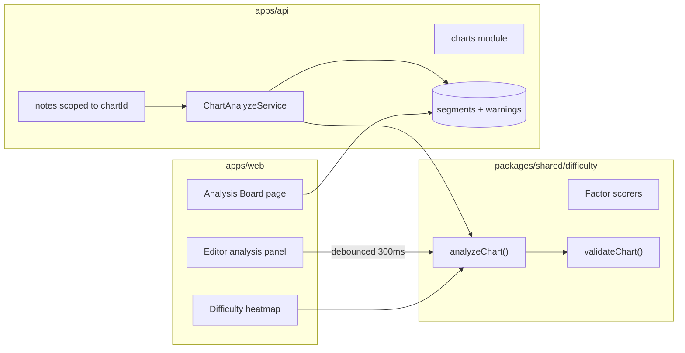

# Difficulty Analysis & Assessment (Design Spec)

**Date:** 2026-05-24  
**Goal:** Full-stack difficulty analysis for rhythm-game level design — multi-chart songs, computed difficulty tiers, live editor feedback, and a dedicated Analysis Board for level designers and QA.

---

## Decisions Locked in Brainstorm

| Topic | Decision |
|---|---|
| Scope | Full stack — shared engine, API persistence, editor + Analysis Board |
| Difficulty label | Computed only — remove manual `song.difficulty`; tier derived from analysis |
| Speed | Per-chart `speedMultiplier` (game runtime preset) |
| Data model | `SongChart` owns notes (`chartId` FK) |
| New songs | One blank chart named `"Main"` |
| Legacy data | Dev wipe — no migration path; schema cutover only |
| Validation | Tier-aware thresholds + soft publish gate (block on `ERROR` severity) |
| UX surfaces | Editor live panel + dedicated Analysis Board page |
| Compute model | Shared engine, dual compute (client debounced + server on note mutation) |

---

## Architecture Overview



**Invariants preserved:**
- Note mutations still write `NoteEvent` ledger entries.
- Soft delete + partial unique index move to `(chart_id, track, time)` scope.
- Duplicate prevention remains DB-enforced (`P2002` → 409).
- Analysis is read-only with respect to notes — never auto-edits chart content.

**Implementation approach:** Shared engine with dual compute (Approach 1 from brainstorm). Client runs `analyzeChart()` debounced for live UX; API runs the same function after note CRUD and persists segments + warnings.

---

## Section 1 — Data Model

### Prisma migration (single cutover)

#### New: `SongChart`

```prisma
model SongChart {
  id                      String         @id @default(uuid())
  songId                  String
  name                    String         @default("Main")
  speedMultiplier         Float          @default(1.0)  // 0.8–2.0
  computedDifficulty      SongDifficulty @default(NORMAL)
  averageDifficultyScore  Float          @default(0)
  peakDifficultyScore     Float          @default(0)
  analyzedAt              DateTime?
  createdAt               DateTime       @default(now())
  updatedAt               DateTime       @updatedAt

  song     Song                    @relation(fields: [songId], references: [id], onDelete: Cascade)
  notes    Note[]
  segments ChartDifficultySegment[]
  warnings ChartValidationWarning[]

  @@index([songId])
  @@map("song_charts")
}
```

#### Update: `Note`

```prisma
model Note {
  // Replace songId FK with chartId as owner
  chartId     String
  // songId retained denormalized for cross-song queries (set from chart.songId on write)
  songId      String
  // track, time, noteType, duration unchanged
  chart SongChart @relation(fields: [chartId], references: [id], onDelete: Cascade)
  song  Song      @relation(fields: [songId], references: [id], onDelete: Cascade)

  @@index([chartId, time])
  @@index([chartId, track])
}

// Replace unique index:
// uq_notes_chart_track_time_active ON (chart_id, track, time) WHERE deleted_at IS NULL
```

#### New: `ChartDifficultySegment`

```prisma
model ChartDifficultySegment {
  id                      String         @id @default(uuid())
  chartId                 String
  startTimeMs             Int
  endTimeMs               Int
  notesPerSecond          Float
  averageLaneJump         Float
  offbeatRatio            Float
  holdNoteRatio           Float
  simultaneousNoteRatio   Float
  patternComplexityScore  Float
  difficultyScore         Float
  difficultyLevel         SongDifficulty

  chart SongChart @relation(fields: [chartId], references: [id], onDelete: Cascade)

  @@index([chartId, startTimeMs])
  @@map("chart_difficulty_segments")
}
```

#### New: `ChartValidationWarning`

```prisma
enum ValidationSeverity { INFO WARN ERROR }

model ChartValidationWarning {
  id           String             @id @default(uuid())
  chartId      String
  code         String
  severity     ValidationSeverity
  startTimeMs  Int?
  endTimeMs    Int?
  message      String
  metadata     Json?

  chart SongChart @relation(fields: [chartId], references: [id], onDelete: Cascade)

  @@index([chartId, severity])
  @@map("chart_validation_warnings")
}
```

#### Update: `Song`

```prisma
model Song {
  // REMOVE: difficulty SongDifficulty
  charts SongChart[]
}
```

On song creation, API auto-creates one `SongChart` named `"Main"` with `speedMultiplier = 1.0`.

### Shared types (`packages/shared/src/types.ts`)

```typescript
export interface SongChart {
  id: string
  songId: string
  name: string
  speedMultiplier: number
  computedDifficulty: SongDifficulty
  averageDifficultyScore: number
  peakDifficultyScore: number
  analyzedAt?: string | null
  createdAt: string
  updatedAt: string
}

export interface ChartDifficultySegment {
  id: string
  chartId: string
  startTimeMs: number
  endTimeMs: number
  notesPerSecond: number
  averageLaneJump: number
  offbeatRatio: number
  holdNoteRatio: number
  simultaneousNoteRatio: number
  patternComplexityScore: number
  difficultyScore: number
  difficultyLevel: SongDifficulty
}

export type ValidationSeverity = 'INFO' | 'WARN' | 'ERROR'

export interface ChartValidationWarning {
  id: string
  chartId: string
  code: string
  severity: ValidationSeverity
  startTimeMs?: number | null
  endTimeMs?: number | null
  message: string
  metadata?: Record<string, unknown> | null
}

export interface ChartAnalysisResult {
  chartId: string
  computedDifficulty: SongDifficulty
  averageDifficultyScore: number
  peakDifficultyScore: number
  segments: ChartDifficultySegment[]
  warnings: ChartValidationWarning[]
  factors: ChartFactorBreakdown
}

export interface ChartFactorBreakdown {
  densityScore: number
  speedScore: number
  laneJumpScore: number
  syncopationScore: number
  holdNoteScore: number
  simultaneousNoteScore: number
  patternComplexityScore: number
  repetitionScore: number       // lower = more repetitive = easier
}
```

`Note` gains `chartId: string`. Remove `difficulty` from `Song`, `CreateProjectSongInput`, create wizard, and templates' manual difficulty fields (templates may keep a `targetSpeedMultiplier` hint instead).

---

## Section 2 — Analysis Engine

**Location:** `packages/shared/src/difficulty/` (pure functions, zero deps).

Replace the existing NPS-only `apps/web/src/features/editor/engine/difficulty-calculator.ts` with re-exports from shared. Keep thin web wrappers for heatmap colors if needed.

### Input

```typescript
export interface AnalyzeChartInput {
  notes: Pick<Note, 'track' | 'time' | 'noteType' | 'duration'>[]
  bpm: number
  timeSignature: string        // e.g. "4/4"
  speedMultiplier: number      // from SongChart
  segmentWindowSeconds?: number // default 5
  songDurationSeconds?: number  // default 300
}
```

### Factor definitions (8 lanes, tracks 1–8)

| Factor | Computation | Notes |
|---|---|---|
| **Note density** | Notes per second in sliding 2s window; segment value = mean NPS in 5s window | Existing `computeNpsOverTime` generalized |
| **Speed** | `speedMultiplier` from chart | Not inferred from BPM; BPM affects syncopation only |
| **Lane jump** | `abs(track[i] - track[i-1])` for consecutive notes by time; normalized `jump / 7` (max span on 8 lanes) | Same-lane = 0 |
| **Syncopation** | Fraction of notes whose `time` is not within ε of a beat grid subdivision | ε = 0.05s; subdivisions: on-beat, half-beat, quarter-beat |
| **Hold notes** | Ratio of HOLD notes + overlap density (holds active while other notes fire) | SWIPE treated like TAP for density |
| **Simultaneous notes** | Notes sharing same `time` (±0.05s): count groups of 2, 3, 4+ | Weight triple+ heavily |
| **Pattern complexity** | Shannon entropy of track transitions in 8-note sliding windows, normalized 0–1 | Higher = harder |
| **Repetition vs surprise** | Autocorrelation of track sequences in 4-bar windows; low correlation = high surprise score | Contributes to complexity |

### Beat / syncopation helper

```typescript
function beatPhase(time: number, bpm: number): number {
  const bd = 60 / bpm
  return (time % bd) / bd  // 0–1 within beat
}

function syncopationWeight(time: number, bpm: number): number {
  const phase = beatPhase(time, bpm)
  const distToGrid = Math.min(
    Math.abs(phase), Math.abs(phase - 0.5),           // on-beat, half-beat
    Math.abs(phase - 0.25), Math.abs(phase - 0.75),   // quarter-beat
  )
  if (distToGrid < 0.05 / beatDuration(bpm)) return 0   // on-beat → easy
  if (distToGrid < 0.08) return 0.5                       // half-beat → medium
  return 1                                                 // off-beat → hard
}
```

Segment `offbeatRatio` = mean syncopation weight of notes in window.

### Segment difficulty score

For each 5-second segment `[t, t+5)`:

```typescript
difficultyScore =
  notesPerSecond        * 2.0
+ averageLaneJump       * 1.5   // raw 0–7 scale
+ offbeatRatio          * 3.0
+ holdNoteRatio         * 2.0
+ simultaneousNoteRatio * 3.0
+ patternComplexityScore * 2.5
+ speedMultiplier       * 2.0
+ surpriseScore         * 1.5   // derived from repetition analysis
```

### Tier mapping (chart-level)

Chart-level score = weighted mean of segment scores (weight by note count per segment; empty segments score 0).

| Score range | `SongDifficulty` |
|---|---|
| 0 – 3 | EASY |
| 3 – 7 | NORMAL |
| 7 – 12 | HARD |
| 12 – 18 | EXPERT |
| 18+ | MASTER |

`computedDifficulty` on `SongChart` = tier of overall chart score.  
`peakDifficultyScore` = max segment score.  
`averageDifficultyScore` = weighted mean.

Per-segment `difficultyLevel` uses the same thresholds on the segment score.

### Heatmap color (segment score → color)

Reuse existing green / yellow / red thresholds, mapped to segment score instead of raw NPS:

| Segment score | Color |
|---|---|
| < 4 | Green `rgba(16,185,129,0.15)` |
| 4 – 10 | Yellow `rgba(245,158,11,0.20)` |
| ≥ 10 | Red `rgba(239,68,68,0.25)` |

### Public API

```typescript
export function analyzeChart(input: AnalyzeChartInput): ChartAnalysisResult
export function analyzeSegments(input: AnalyzeChartInput): ChartDifficultySegment[]
export function validateChart(
  analysis: ChartAnalysisResult,
  tier: SongDifficulty,
): ChartValidationWarning[]
export function scoreToDifficulty(score: number): SongDifficulty
export function difficultyToSpeedSuggestion(tier: SongDifficulty): number
// EASY 1.0, NORMAL 1.2, HARD 1.5, EXPERT 1.8, MASTER 2.0
```

---

## Section 3 — Validation Rules

Validation runs after analysis. Warnings are tier-aware: thresholds come from the chart's current tier — `scoreToDifficulty(averageDifficultyScore)` on the client (live panel) and persisted `computedDifficulty` on the server (Analysis Board + publish gate).

### Warning codes

| Code | Severity | Rule |
|---|---|---|
| `DIFFICULTY_SPIKE` | WARN | Segment score > 2× chart average AND > tier max segment score |
| `DIFFICULTY_SPIKE` | ERROR | Segment score > 3× chart average |
| `HIGH_DENSITY` | WARN/ERROR | NPS exceeds tier limit (see table below) |
| `EXCESSIVE_LANE_JUMP` | WARN | ≥ 3 consecutive jumps with distance ≥ 5 |
| `EXCESSIVE_OFFBEAT` | WARN | Segment `offbeatRatio` > tier limit |
| `TOO_MANY_DOUBLES` | WARN | > tier limit simultaneous pairs per 10s |
| `TOO_MANY_TRIPLES` | ERROR | Any triple+ simultaneous group on EASY/NORMAL; > 2 per minute on HARD+ |
| `HOLD_OVERLAP_STRESS` | WARN | HOLD active on lane A while ≥ 2 taps on other lanes in same 0.5s |
| `EMPTY_SECTION` | INFO | 5s segment with 0 notes inside a chart with > 20 total notes |
| `SPEED_TIER_MISMATCH` | WARN | `speedMultiplier` differs from `difficultyToSpeedSuggestion(computedDifficulty)` by > 0.3 |
| `CHART_TOO_EASY_FOR_TIER` | WARN | User-named chart contains "Hard" but computed EASY (name heuristic only, INFO-level) |

### Tier thresholds (NPS peak per 2s window)

| Tier | Max NPS (WARN) | Max NPS (ERROR) | Max offbeat ratio | Max doubles / 10s |
|---|---|---|---|---|
| EASY | 2.5 | 3.5 | 0.20 | 0 |
| NORMAL | 4.0 | 5.5 | 0.35 | 1 |
| HARD | 6.0 | 7.5 | 0.50 | 3 |
| EXPERT | 8.0 | 10.0 | 0.65 | 5 |
| MASTER | 10.0 | 12.0 | 0.80 | 8 |

### Publish soft gate

On workflow transition **`IN_REVIEW → APPROVED`** and **`APPROVED → PUBLISHED`**:

1. Load latest analysis for **every chart** on the song.
2. If any chart has ≥ 1 `ERROR` warning → reject with `422 Unprocessable Entity` and payload `{ blockingWarnings: ChartValidationWarning[] }`.
3. `WARN` and `INFO` do not block; shown on Analysis Board for QA acknowledgment.

Composer role sees toast: *"Cannot submit: 2 blocking validation errors on chart Main. Open Analysis Board to fix."*

---

## Section 4 — API

### New module: `apps/api/src/modules/charts/`

| Method | Path | Description |
|---|---|---|
| GET | `/songs/:songId/charts` | List charts for song |
| POST | `/songs/:songId/charts` | Create chart `{ name, speedMultiplier? }` |
| GET | `/charts/:chartId` | Chart detail + summary scores |
| PATCH | `/charts/:chartId` | Update name, speedMultiplier |
| DELETE | `/charts/:chartId` | Delete chart + cascade notes (guard: ≥ 1 chart per song) |
| POST | `/charts/:chartId/duplicate` | Clone chart + all notes; optional `{ name, speedMultiplier }` |
| GET | `/charts/:chartId/analysis` | Full `ChartAnalysisResult` from DB (segments + warnings) |
| POST | `/charts/:chartId/analyze` | Force recompute + persist (returns same as GET) |

### Notes API change

All note routes scoped under chart:

| Old | New |
|---|---|
| `GET /songs/:songId/notes` | `GET /charts/:chartId/notes` |
| `POST /songs/:songId/notes` | `POST /charts/:chartId/notes` |

Keep temporary alias `GET /songs/:songId/notes` → resolves default/first chart during transition week (optional; skip if dev wipe).

### `ChartAnalyzeService`

Called synchronously after note create/update/delete/batch (same transaction boundary as note write, after commit):

1. Load chart + song (bpm, timeSignature) + active notes.
2. Run `analyzeChart()` from shared.
3. Run `validateChart()`.
4. Upsert: update chart scores, replace segments (`deleteMany` + `createMany`), replace warnings.
5. Emit `chart.analyzed` on EventEmitter (optional realtime for Analysis Board).

Debounce at API layer is not required — note mutations are already discrete. Bulk paste triggers one analyze at end of batch.

### Song creation

`SongsService.create` after insert:

```typescript
await chartsService.createDefaultChart(song.id) // name: "Main", speed 1.0
```

Remove `difficulty` from `CreateProjectSongDto`.

---

## Section 5 — Editor Live Panel

Docked inside editor tools sidebar (extend existing `BottomBarStats` / tools tab).

### Chart switcher (toolbar)

- Dropdown next to song name: lists charts for current song.
- Actions: **New chart**, **Duplicate chart**, **Chart settings** (name + speed slider 0.8–2.0).
- Switching chart reloads notes query for `chartId`.

### Live analysis strip (always visible when chart loaded)

```
┌─────────────────────────────────────┐
│ ♦ HARD  Score 9.2  Peak 14.1  1.5× │
│ [████░░░░░░] Section timeline 0–60s │
│ ⚠ 2 warnings  ℹ 1 info              │
│ [Open Analysis Board →]             │
└─────────────────────────────────────┘
```

- **Tier badge** — `computedDifficulty`, color from `SongDifficultyEnum`.
- **Section timeline** — 5s windows as colored chips; click seeks playhead.
- **Warning summary** — expandable list inline (top 3); full list on Board.
- **Factor mini-bars** — 8 horizontal bars (density, speed, jumps, …) normalized 0–1.

### Heatmap upgrade

`DifficultyOverlay` uses segment scores from debounced client `analyzeChart()` instead of raw NPS. Toggle remains in tools panel.

### Debounce

```typescript
const analysis = useMemo(
  () => analyzeChart({ notes, bpm, timeSignature, speedMultiplier }),
  [notes, bpm, timeSignature, speedMultiplier],
)
// wrap notes dependency with 300ms debounce via useDebouncedValue(notes, 300)
```

Client analysis is display-only until server persists; after note save, invalidate `['chart-analysis', chartId]` to sync.

---

## Section 6 — Analysis Board Page

**Route:** `/projects/:projectId/songs/:songId/charts/:chartId/analysis`

Accessible from editor panel link, song table row action, and QA dashboard.

### Layout

```
┌──────────────────────────────────────────────────────────────┐
│ ← Back to Editor    Song Name / Chart: Main    ♦ HARD  1.5× │
├──────────────────────────────────────────────────────────────┤
│ [Avg 9.2] [Peak 14.1] [Notes 847] [Warnings 2⚠ 1ℹ] [Seg 60]│
├────────────────────────────┬─────────────────────────────────┤
│  SECTION TIMELINE (full)   │  FACTOR BREAKDOWN (radar/bar)   │
│  clickable 5s bands        │  8 factors with tier limits     │
├────────────────────────────┴─────────────────────────────────┤
│  WARNINGS TABLE  filter: All | Error | Warn | Info           │
│  time range | code | message | severity                      │
├──────────────────────────────────────────────────────────────┤
│  SIBLING CHARTS (same song)                                  │
│  Main HARD 9.2 | Easy copy EASY 3.1 | Expert WIP —           │
└──────────────────────────────────────────────────────────────┘
```

### Interactions

- Click segment band → deep-link to editor at `startTimeMs` with heatmap on.
- Click warning row → seek editor to warning range.
- Sibling chart cards → navigate to that chart's board.
- **Re-analyze** button → `POST /charts/:id/analyze` (shows spinner, refreshes).

### QA workflow affordances

- Filter warnings by severity.
- Export summary JSON (V1: copy to clipboard; future: PDF).
- Blocking errors highlighted red banner: *"This chart blocks publish approval."*

---

## Section 7 — Cross-Cutting Integrations

### Create song wizard

- Remove difficulty picker step/field.
- Copy: *"Difficulty is computed automatically from your chart after you add notes."*
- Templates drop `difficulty`; may set `speedMultiplier` on default chart via API after create.

### Song table / dashboard

- Replace difficulty column with **Chart summary**: `"Main · Hard"` or `"2 charts · peak Expert"`.
- Sort by `peakDifficultyScore` across charts (API aggregate query).

### AI chart generation

- `AiGenerateChartModal`: remove song difficulty input; add optional **target tier** hint (`EASY`…`MASTER`) passed as generation constraint only — does not write to DB.
- After AI inserts notes, trigger analyze; show post-gen warnings in modal.

### Workflow / permissions

- Analysis readable by all project members with song access.
- Chart CRUD follows existing song edit permissions.
- `isSongChartReadOnly` unchanged (PUBLISHED / ARCHIVED songs → analysis read-only, no note edits).

---

## Section 8 — Testing

### Unit tests (`packages/shared/src/difficulty/__tests__/`)

| Test | Assert |
|---|---|
| Empty chart | EASY, score 0, no warnings |
| Straight 1-2-3-4 pattern | Low jump score, low complexity |
| Random jumps 1-8-2-7 | High jump + complexity |
| All on-beat quarter notes | offbeatRatio ≈ 0 |
| Syncopated eighth notes | offbeatRatio > 0.5 |
| Simultaneous pair | simultaneousNoteRatio > 0 |
| Triple on EASY chart | `TOO_MANY_TRIPLES` ERROR |
| 5s spike vs flat chart | `DIFFICULTY_SPIKE` WARN |
| speedMultiplier 2.0 | speedScore increases tier |
| Tier mapping boundaries | 2.9→EASY, 3.0→NORMAL, etc. |

### API integration tests

- Create song → default chart exists.
- Add notes → segments persisted, chart scores updated.
- `IN_REVIEW → APPROVED` with ERROR warning → 422.
- Duplicate chart → notes copied, independent analysis.

### Web tests

- `ChartSwitcher` renders charts.
- Analysis panel shows tier from mock analysis.
- Heatmap uses segment colors.

---

## Section 9 — File Map

```
NEW:
packages/shared/src/difficulty/
  index.ts
  analyze-chart.ts
  factors.ts
  validate-chart.ts
  tier-thresholds.ts
  types.ts
  __tests__/...

apps/api/src/modules/charts/
  charts.module.ts
  charts.controller.ts
  charts.service.ts
  chart-analyze.service.ts
  dto/

apps/web/src/features/analysis/
  AnalysisBoardPage.tsx
  SectionTimeline.tsx
  FactorBreakdown.tsx
  WarningsTable.tsx
  SiblingCharts.tsx
  useChartAnalysis.ts

apps/web/src/features/charts/
  ChartSwitcher.tsx
  ChartSettingsModal.tsx
  useCharts.ts
  useDuplicateChart.ts

MODIFY:
apps/api/prisma/schema.prisma
apps/api/src/modules/notes/*          (chartId scope)
apps/api/src/modules/songs/*          (remove difficulty, create default chart)
apps/web/src/features/editor/engine/difficulty-calculator.ts  → re-export shared
apps/web/src/features/editor/components/DifficultyOverlay.tsx
apps/web/src/features/editor/components/BottomBarStats.tsx   → AnalysisSummaryPanel
apps/web/src/pages/EditorPage.tsx
apps/web/src/features/songs/create-wizard/*
packages/shared/src/types.ts
packages/shared/src/index.ts
```

---

## Section 10 — Out of Scope (V1)

- Auto-balancing / AI rewrite of hard sections
- Multiple simultaneous editable charts (one active chart per editor session)
- Player-facing speed calibration from device performance
- Historical analysis diff across song versions
- `song_difficulty_segments` naming — use `chart_difficulty_segments` instead

---

## Success Criteria

- [ ] New song gets one `Main` chart; no manual difficulty anywhere in UI
- [ ] Composite score uses all 8 factors; tier computed consistently client + server
- [ ] Editor panel updates within 300ms of note changes
- [ ] Analysis Board shows segments, factors, warnings, sibling charts
- [ ] Heatmap reflects segment difficulty score (not NPS alone)
- [ ] Publish blocked when any chart has ERROR validation
- [ ] Tier-aware warnings differ for EASY vs EXPERT charts
- [ ] Unit tests cover factor math and validation rules
