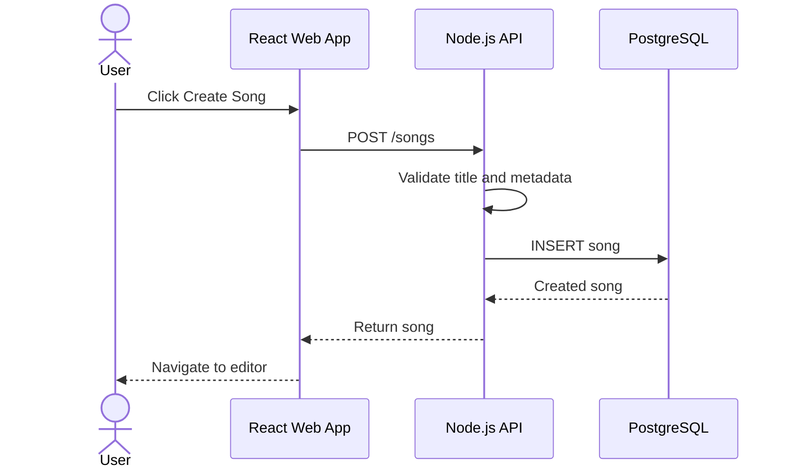
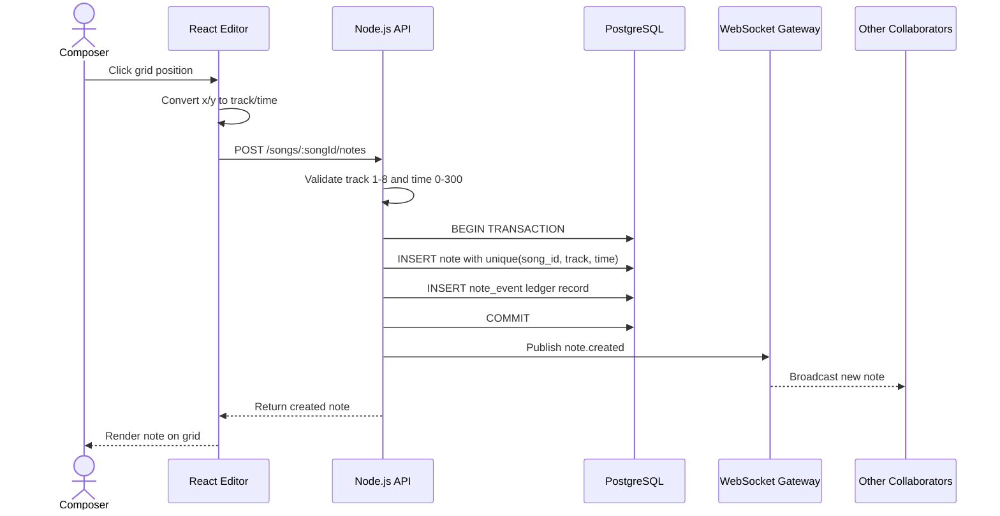
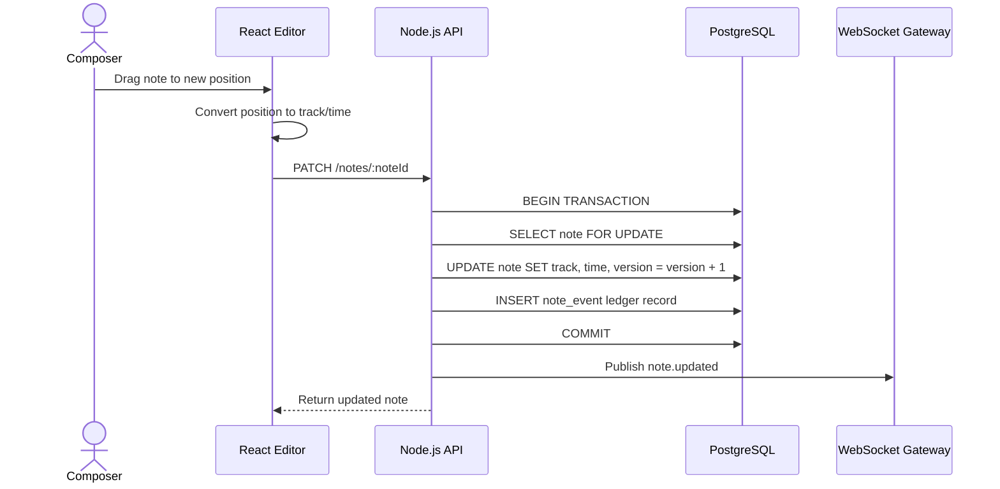
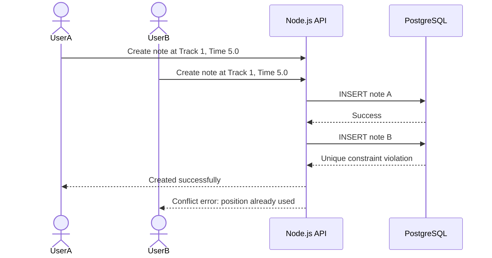
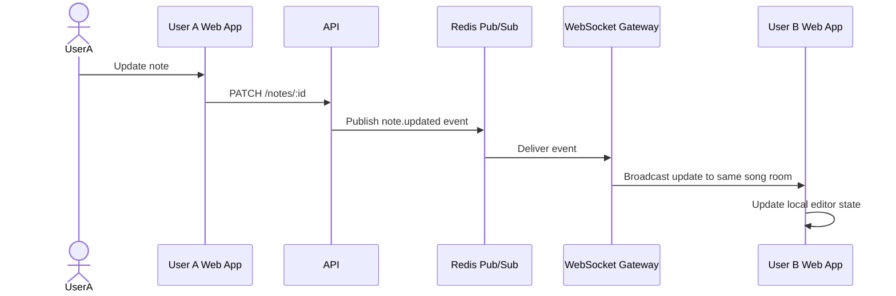
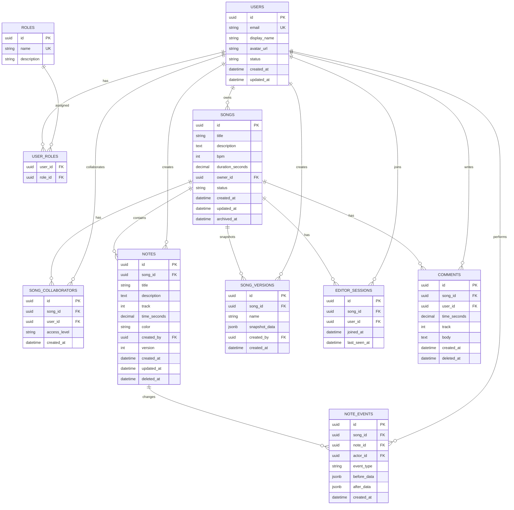

# AMA-MIDI Project Planning Documents

## 1. Project Brief

### Project Name
**AMA-MIDI — Enterprise MIDI Editor & Collaboration Suite**

### Product Goal
Build an internal web-based MIDI sequencing tool for Amanotes teams to prototype game soundtrack note sequences quickly, safely, and collaboratively.

### Main Problem
Current MIDI/editor workflows are usually designed for individual composers and complex music production users. Amanotes needs an internal tool that is simpler, collaborative, web-based, and suitable for composers, game developers, and product stakeholders who need to inspect or adjust soundtrack timing.

### Core Product Idea
AMA-MIDI provides a piano-roll style editor where users can manage notes across **8 tracks**, with **time flowing vertically from 0s to 300s**. Users can create, edit, move, delete, and collaborate on notes in real time while the system protects sequence integrity.

### Main Users
- **Composer**: creates and adjusts note sequences.
- **Game Developer**: checks timing alignment and integrates sequences into gameplay.
- **Producer / Product Owner**: reviews sequence versions and approves direction.
- **Admin**: manages users, access, and system settings.

---

## 2. Product Scope

### MVP Scope
The MVP should prove four things:

1. Users can create and manage songs.
2. Users can visualize notes on an 8-track vertical timeline.
3. Users can safely CRUD notes without duplicate note positions.
4. Multiple users can collaborate on the same song without corrupting data.

### In Scope

#### Song Management
- Create song
- View song list
- Open song editor
- Edit song metadata
- Archive/delete song

#### Piano Roll Editor
- 8 fixed tracks on X-axis
- Vertical timeline from 0s to 300s
- Notes rendered as circular points
- Accurate position mapping by track and time
- Zoom and scroll support
- Optional snap-to-grid interaction

#### Note Management
- Create note
- Read note detail
- Update note title, description, track, time, color
- Delete note
- Drag note to change track/time
- Prevent duplicate note at same song, track, and time

#### Collaboration
- Real-time note creation/update/delete sync
- User presence in song editor
- Conflict-safe writes
- Optimistic UI with rollback on failure

#### History / Ledger
- Track every note change as an event
- Store before/after values where useful
- Allow users to inspect change history

#### Basic Security
- Login/authentication
- Role-based access control
- Rate limiting
- CSRF protection if cookie-based auth is used

#### Performance
- Efficient rendering for 10,000+ notes
- Pagination or virtualization where needed
- Performance testing plan

### Out of Scope for MVP
- Full audio playback engine
- Import/export real MIDI files
- Advanced music theory validation
- Multi-song arrangement timeline
- Mobile-first editing experience
- Complex DAW features like velocity curves, automation lanes, piano keyboard input

---

## 3. Feature List

### 3.1 Must-Have Features

| Feature | Description | Priority |
|---|---|---|
| Authentication | Users can log in securely | P0 |
| Song CRUD | Users can create, view, edit, archive songs | P0 |
| Piano Roll Grid | 8 tracks horizontally, 0–300s vertically | P0 |
| Note CRUD | Users can create, edit, delete notes | P0 |
| Duplicate Prevention | No two notes can exist at same song + track + time | P0 |
| Real-time Sync | Multiple users see note changes instantly | P0 |
| Change History | Note operations are recorded as ledger events | P1 |
| Optimistic UI | UI updates quickly, then confirms with server | P1 |
| Conflict Handling | Failed duplicate or stale updates show clear error | P1 |
| Basic Role Permission | Composer/editor/viewer/admin permissions | P1 |
| Performance Mode | Can render 10,000 notes efficiently | P1 |

### 3.2 Should-Have Features

| Feature | Description | Priority |
|---|---|---|
| User Presence | Show who is currently editing the song | P2 |
| Snap-to-Grid | Notes align to configured time interval | P2 |
| Search Notes | Search notes by title/description | P2 |
| Filter by Track | Show/hide specific tracks | P2 |
| Song Version Snapshot | Save named versions for review | P2 |
| AI Note Suggester | Suggest next note based on existing pattern | P2 |

### 3.3 Nice-to-Have Features

| Feature | Description | Priority |
|---|---|---|
| MIDI Export | Export sequence to MIDI-like format | P3 |
| Comment on Timeline | Allow review comments at specific time | P3 |
| Approval Workflow | Composer submits sequence for review | P3 |
| Heatmap Mode | Highlight dense note areas | P3 |

---

## 4. User Roles and Permissions

| Role | Permission |
|---|---|
| Admin | Manage users, roles, all songs, all notes |
| Composer | Create/edit songs and notes |
| Developer | View songs, inspect notes, export/integrate data |
| Reviewer | View songs and history, leave comments if enabled |
| Viewer | Read-only access |

### Permission Matrix

| Action | Admin | Composer | Developer | Reviewer | Viewer |
|---|---:|---:|---:|---:|---:|
| Create song | Yes | Yes | No | No | No |
| Edit song | Yes | Yes | No | No | No |
| Archive song | Yes | Owner only | No | No | No |
| View song | Yes | Yes | Yes | Yes | Yes |
| Create note | Yes | Yes | No | No | No |
| Update note | Yes | Yes | No | No | No |
| Delete note | Yes | Yes | No | No | No |
| View history | Yes | Yes | Yes | Yes | No |
| Manage users | Yes | No | No | No | No |

---

## 5. Main User Flows

### 5.1 Create a Song



### 5.2 Create a Note



### 5.3 Update / Drag a Note



### 5.4 Conflict: Two Users Create Same Note Position



### 5.5 Real-Time Collaboration Sync



---

## 6. Domain Model

### Core Entities

| Entity | Purpose |
|---|---|
| users | People using the system |
| roles | Defines access level |
| user_roles | Assigns roles to users |
| songs | Main MIDI sequence document |
| song_collaborators | Users allowed to access a song |
| notes | Current state of notes in a song |
| note_events | Ledger/history of note changes |
| song_versions | Optional snapshots of song state |
| editor_sessions | Tracks active collaborators |
| comments | Optional review comments |

---

## 7. ERD



---

## 8. Database Schema Draft

```sql
CREATE TABLE users (
    id UUID PRIMARY KEY DEFAULT gen_random_uuid(),
    email VARCHAR(255) NOT NULL UNIQUE,
    display_name VARCHAR(120) NOT NULL,
    avatar_url TEXT,
    status VARCHAR(30) NOT NULL DEFAULT 'active',
    created_at TIMESTAMPTZ NOT NULL DEFAULT now(),
    updated_at TIMESTAMPTZ NOT NULL DEFAULT now()
);

CREATE TABLE roles (
    id UUID PRIMARY KEY DEFAULT gen_random_uuid(),
    name VARCHAR(50) NOT NULL UNIQUE,
    description TEXT
);

CREATE TABLE user_roles (
    user_id UUID NOT NULL REFERENCES users(id),
    role_id UUID NOT NULL REFERENCES roles(id),
    PRIMARY KEY (user_id, role_id)
);

CREATE TABLE songs (
    id UUID PRIMARY KEY DEFAULT gen_random_uuid(),
    title VARCHAR(200) NOT NULL,
    description TEXT,
    bpm INT NOT NULL DEFAULT 120,
    duration_seconds NUMERIC(6, 2) NOT NULL DEFAULT 300.00,
    owner_id UUID NOT NULL REFERENCES users(id),
    status VARCHAR(30) NOT NULL DEFAULT 'draft',
    created_at TIMESTAMPTZ NOT NULL DEFAULT now(),
    updated_at TIMESTAMPTZ NOT NULL DEFAULT now(),
    archived_at TIMESTAMPTZ,
    CONSTRAINT chk_song_duration CHECK (duration_seconds > 0 AND duration_seconds <= 300)
);

CREATE TABLE song_collaborators (
    id UUID PRIMARY KEY DEFAULT gen_random_uuid(),
    song_id UUID NOT NULL REFERENCES songs(id) ON DELETE CASCADE,
    user_id UUID NOT NULL REFERENCES users(id) ON DELETE CASCADE,
    access_level VARCHAR(30) NOT NULL DEFAULT 'editor',
    created_at TIMESTAMPTZ NOT NULL DEFAULT now(),
    UNIQUE (song_id, user_id)
);

CREATE TABLE notes (
    id UUID PRIMARY KEY DEFAULT gen_random_uuid(),
    song_id UUID NOT NULL REFERENCES songs(id) ON DELETE CASCADE,
    title VARCHAR(200) NOT NULL,
    description TEXT,
    track INT NOT NULL,
    time_seconds NUMERIC(6, 2) NOT NULL,
    color VARCHAR(20) NOT NULL DEFAULT '#7C3AED',
    created_by UUID NOT NULL REFERENCES users(id),
    version INT NOT NULL DEFAULT 1,
    created_at TIMESTAMPTZ NOT NULL DEFAULT now(),
    updated_at TIMESTAMPTZ NOT NULL DEFAULT now(),
    deleted_at TIMESTAMPTZ,
    CONSTRAINT chk_note_track CHECK (track BETWEEN 1 AND 8),
    CONSTRAINT chk_note_time CHECK (time_seconds >= 0 AND time_seconds <= 300)
);

-- Prevent duplicate active notes in the same position.
CREATE UNIQUE INDEX uq_notes_song_track_time_active
ON notes (song_id, track, time_seconds)
WHERE deleted_at IS NULL;

CREATE INDEX idx_notes_song_time ON notes (song_id, time_seconds);
CREATE INDEX idx_notes_song_track ON notes (song_id, track);

CREATE TABLE note_events (
    id UUID PRIMARY KEY DEFAULT gen_random_uuid(),
    song_id UUID NOT NULL REFERENCES songs(id) ON DELETE CASCADE,
    note_id UUID REFERENCES notes(id) ON DELETE SET NULL,
    actor_id UUID NOT NULL REFERENCES users(id),
    event_type VARCHAR(50) NOT NULL,
    before_data JSONB,
    after_data JSONB,
    created_at TIMESTAMPTZ NOT NULL DEFAULT now()
);

CREATE INDEX idx_note_events_song_created_at
ON note_events (song_id, created_at DESC);

CREATE TABLE song_versions (
    id UUID PRIMARY KEY DEFAULT gen_random_uuid(),
    song_id UUID NOT NULL REFERENCES songs(id) ON DELETE CASCADE,
    name VARCHAR(200) NOT NULL,
    snapshot_data JSONB NOT NULL,
    created_by UUID NOT NULL REFERENCES users(id),
    created_at TIMESTAMPTZ NOT NULL DEFAULT now()
);

CREATE TABLE editor_sessions (
    id UUID PRIMARY KEY DEFAULT gen_random_uuid(),
    song_id UUID NOT NULL REFERENCES songs(id) ON DELETE CASCADE,
    user_id UUID NOT NULL REFERENCES users(id) ON DELETE CASCADE,
    joined_at TIMESTAMPTZ NOT NULL DEFAULT now(),
    last_seen_at TIMESTAMPTZ NOT NULL DEFAULT now(),
    UNIQUE (song_id, user_id)
);

CREATE TABLE comments (
    id UUID PRIMARY KEY DEFAULT gen_random_uuid(),
    song_id UUID NOT NULL REFERENCES songs(id) ON DELETE CASCADE,
    user_id UUID NOT NULL REFERENCES users(id),
    time_seconds NUMERIC(6, 2),
    track INT,
    body TEXT NOT NULL,
    created_at TIMESTAMPTZ NOT NULL DEFAULT now(),
    deleted_at TIMESTAMPTZ,
    CONSTRAINT chk_comment_track CHECK (track IS NULL OR track BETWEEN 1 AND 8),
    CONSTRAINT chk_comment_time CHECK (time_seconds IS NULL OR (time_seconds >= 0 AND time_seconds <= 300))
);
```

---

## 9. API Scope

### Auth

| Method | Endpoint | Purpose |
|---|---|---|
| POST | /auth/login | Login |
| POST | /auth/logout | Logout |
| GET | /auth/me | Current user |

### Songs

| Method | Endpoint | Purpose |
|---|---|---|
| GET | /songs | List songs |
| POST | /songs | Create song |
| GET | /songs/:id | Get song detail |
| PATCH | /songs/:id | Update song |
| DELETE | /songs/:id | Archive song |

### Notes

| Method | Endpoint | Purpose |
|---|---|---|
| GET | /songs/:songId/notes | List notes in song |
| POST | /songs/:songId/notes | Create note |
| GET | /notes/:id | Get note detail |
| PATCH | /notes/:id | Update note |
| DELETE | /notes/:id | Delete note |

### Collaboration

| Method | Endpoint | Purpose |
|---|---|---|
| GET | /songs/:songId/collaborators | List collaborators |
| POST | /songs/:songId/collaborators | Add collaborator |
| DELETE | /songs/:songId/collaborators/:userId | Remove collaborator |
| GET | /songs/:songId/presence | Active users |

### History

| Method | Endpoint | Purpose |
|---|---|---|
| GET | /songs/:songId/events | Note change history |
| POST | /songs/:songId/versions | Create snapshot |
| GET | /songs/:songId/versions | List snapshots |

---

## 10. WebSocket Events

### Client to Server

| Event | Payload | Purpose |
|---|---|---|
| song.join | songId | Join song room |
| song.leave | songId | Leave song room |
| cursor.move | songId, x, y | Broadcast editing presence |
| note.create.request | note payload | Optional socket-based create |
| note.update.request | note payload | Optional socket-based update |

### Server to Client

| Event | Payload | Purpose |
|---|---|---|
| note.created | note | New note created |
| note.updated | note | Note updated |
| note.deleted | noteId | Note deleted |
| note.conflict | error | Duplicate/stale update conflict |
| user.joined | user | Collaborator joined |
| user.left | user | Collaborator left |
| cursor.moved | userId, x, y | Show collaborator cursor |

---

## 11. Validation Rules

### Song Rules
- Title is required.
- Duration must be greater than 0 and less than or equal to 300 seconds.
- Only owner/admin can archive a song.

### Note Rules
- Title is required.
- Track must be from 1 to 8.
- Time must be from 0 to 300 seconds.
- Color must be a valid supported color or hex value.
- A song cannot have two active notes at the same track and time.
- Update should check note version to prevent stale writes.

### Collaboration Rules
- User must have song access before joining editor room.
- Viewers cannot create/update/delete notes.
- Every create/update/delete action must create a note_event record.

---

## 12. Testing Plan

### Unit Tests
- Convert grid x/y position to track/time.
- Validate track range 1–8.
- Validate time range 0–300.
- Validate duplicate note rule.
- Validate optimistic update reducer.

### Integration Tests
- Create song successfully.
- Create note successfully.
- Reject note at 301s.
- Reject note on track 9.
- Reject duplicate note at same song, track, time.
- Update note and create ledger event.
- Delete note and create ledger event.

### Concurrency Tests
- Two users create note at same position simultaneously.
- Two users update same note with stale version.
- Multiple rapid drag updates do not corrupt final note position.

### Performance Tests
- Seed 10,000 notes.
- Measure initial editor render time.
- Measure drag interaction latency.
- Measure zoom/scroll smoothness.
- Simulate burst creation with k6 or similar load tool.

---

## 13. Architecture Decision Record

### Decision 1: Use Modular Monolith
Use a modular monolith instead of microservices.

**Reason:** The case study has a 3-day timeline. A modular monolith is faster to build and easier to explain, while still allowing clean separation between auth, songs, notes, collaboration, history, and AI modules.

### Decision 2: Use PostgreSQL for Notes
Use PostgreSQL for song/note data.

**Reason:** The project needs transactional integrity, unique constraints, row locking, and reliable history tracking.

### Decision 3: Use Redis Pub/Sub or WebSocket Gateway
Use Redis Pub/Sub with WebSockets for real-time collaboration.

**Reason:** Multiple users need to see note changes instantly. Redis also supports scaling WebSocket events later.

### Decision 4: Use Ledger/Event History
Store note changes in `note_events`.

**Reason:** The case study expects change history/ledger logic. This also helps debugging and product review.

### Decision 5: Optimize Rendering for 10,000 Notes
Use canvas/SVG virtualization or viewport-based rendering instead of rendering all notes as normal DOM nodes.

**Reason:** 10,000 DOM elements can become slow during zooming, dragging, and scrolling.

---

## 14. Suggested Folder Structure

```text
ama-midi/
  apps/
    web/
      src/
        app/
        components/
        features/
          auth/
          songs/
          editor/
          notes/
          collaboration/
          history/
        hooks/
        lib/
        types/
    api/
      src/
        modules/
          auth/
          users/
          songs/
          notes/
          collaboration/
          history/
          ai/
        common/
        database/
        main.ts
  packages/
    shared/
      src/
        types/
        validators/
  docker-compose.yml
  README.md
  .env.example
```

---

## 15. Delivery Sequence

### Phase 1: Product Foundation
- Define users and roles.
- Confirm MVP scope.
- Draw user flows.
- Create wireframe for song list and editor screen.

### Phase 2: Data and Backend Foundation
- Set up Node.js API.
- Set up PostgreSQL.
- Create users, songs, notes, note_events tables.
- Implement song CRUD.
- Implement note CRUD with unique constraint.

### Phase 3: Editor UI
- Build 8-track grid.
- Render notes as circular points.
- Convert coordinates to track/time.
- Add create/edit/delete note interactions.

### Phase 4: Collaboration
- Add WebSocket room per song.
- Broadcast note changes.
- Add basic user presence.
- Handle conflict responses.

### Phase 5: Integrity and History
- Add transaction around note writes.
- Add note_events ledger.
- Add optimistic concurrency using version field.
- Add history panel.

### Phase 6: Performance and Polish
- Seed 10,000 notes.
- Optimize rendering.
- Add loading, error, and empty states.
- Add dark mode studio UI.

### Phase 7: DevOps and Documentation
- Add Docker Compose.
- Add GitHub Actions.
- Add README.
- Add architecture diagram.
- Add test plan and trade-off explanation.

---

## 16. Interview Presentation Structure

### Slide 1: Problem
Amanotes needs a web-based collaborative MIDI sequence editor for internal teams.

### Slide 2: Users
Composer, Developer, Reviewer, Admin.

### Slide 3: MVP Scope
Song management, piano roll visualization, note CRUD, duplicate prevention, real-time collaboration.

### Slide 4: Core Workflow
Create song → open editor → create notes → collaborate → sync → inspect history.

### Slide 5: Data Model
Show ERD and explain unique constraint on song + track + time.

### Slide 6: Architecture
React + Node.js + PostgreSQL + Redis/WebSocket.

### Slide 7: Integrity
Transactions, unique index, optimistic versioning, ledger events.

### Slide 8: Performance
10,000-note rendering strategy and test plan.

### Slide 9: Security
Auth, RBAC, rate limiting, CSRF protection.

### Slide 10: Trade-offs
Modular monolith first, Redis for real-time sync, PostgreSQL for transactional integrity.

---

## 17. Strong Positioning Statement

This project is not only a MIDI CRUD app. It is a product-engineering solution for internal music-game operations. The system focuses on safe collaboration, sequence integrity, real-time synchronization, performance, and clear operational history.
